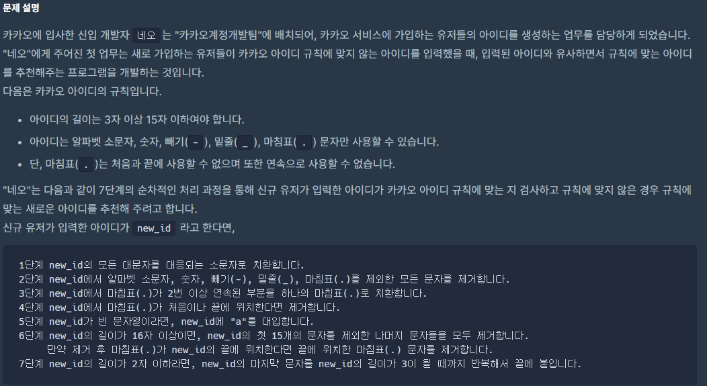
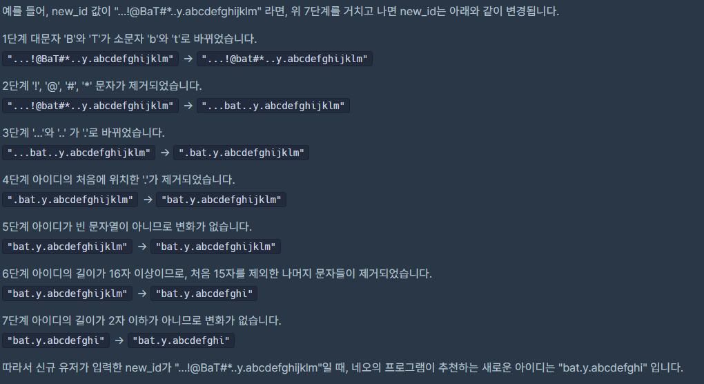
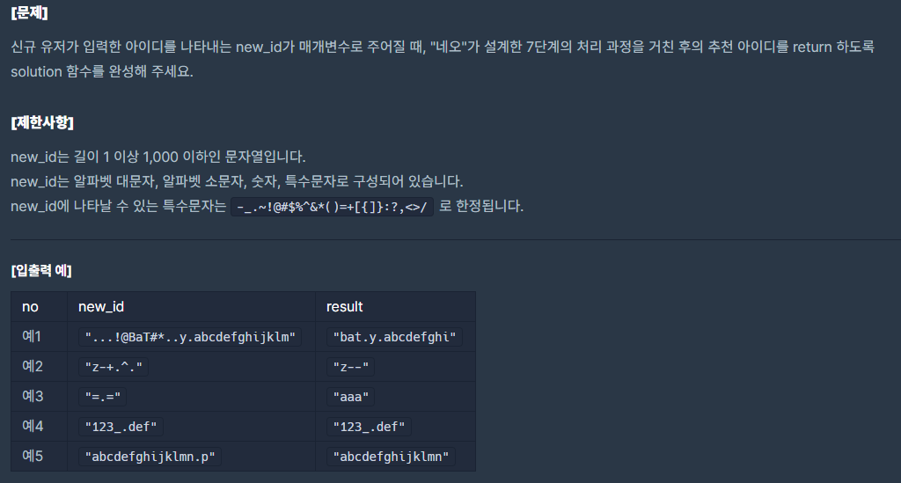

## [[KAKAO BLIND RECRUITMENT] 신규 아이디 추천](https://programmers.co.kr/learn/courses/30/lessons/72410)



___

## 💡 풀이
- 1단계 : 아스키 코드를 이용하여 대문자에 32를 더해서 소문자로 변환하여 answer 뒤에 추가
- 2단계 : -, _, 숫자, 소문자인 경우에만 answer 뒤에 추가
- 3단계 : answer이 비어있지 않고, answer의 맨 뒤가 .이 아닌 경우 answer 뒤에 추가
- 4단계 : new_id의 마지막 문자가 .인 경우 answer 뒤에 추가하지 않음
- 5단계 : 반복문이 끝났을 때, answer가 비어있는 경우 answer 뒤에 a를 추가
- 6단계 : 반복문 인덱스가 15가 되면 반복문 탈출
- 7단계 : 반복문이 끝났을 때, answer의 크기가 3미만인 경우 answer 맨 뒤의 문자를 answer 뒤에 추가
___
```c++
#include <string>
#include <vector>

using namespace std;

string solution(string new_id) {
    string answer = "";
    int idx = 0;
    for(char c : new_id){
        if(c >= 'A' && c <= 'Z')
            answer += (c + 32);
        else if(c == '-' || c == '_' || (c >= '0' && c <= '9') || (c >= 'a' && c <= 'z'))
            answer += c;
        else if(c == '.'){
            if(!answer.empty() && answer.back() != '.')
                answer += c;
        }
        
        idx++;
        if(answer.size() == 15 || idx == new_id.size()){
            if(!answer.empty() && answer.back() == '.')
                answer.pop_back();
            
            while(answer.size() < 3){
                if(answer.empty())
                    answer += 'a';
                else
                    answer += answer.back();
            }
            break;
        }
    }
    
    return answer;
}
```