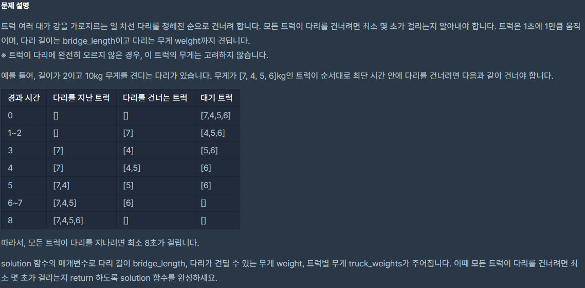
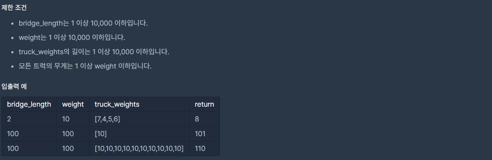

## [[Lv. 2] 다리를 지나는 트럭](https://programmers.co.kr/learn/courses/30/lessons/42583)
<br>
<br>
큐는 선입선출(FIFO) 구조인 선형 자료구조이다.
<br>
큐 : 다리<br>
데이터 : 트럭<br>
먼저, 인자로 받은 다리의 길이만큼 큐를 0으로 채워넣고, 아래의 조건에 해당하면 순서대로 트럭을, 그렇지 않으면 0을 큐에 push 한다. (매번 pop 해주는 것도 잊지 말자)<br>
1. 다리를 지나는 트럭의 수가 다리 길이를 초과할 수 없다.
2. 다리를 지나는 트럭의 무게가 weight를 초과할 수 없다.

```c++
#include <vector>
#include <string>
#include <queue>

using namespace std;

#define EMPTY 0

int solution(int bridge_length, int weight, vector<int> truck_weights) {
    int answer = 0;
    queue<int> q;
    int n = 0;
    int w = 0;
    int len = bridge_length;
    int size = truck_weights.size();
    int idx = 0;

    for (int i = 0; i < len; i++) {
        q.push(EMPTY);
    }

    while (idx != size) {;
        if(q.front() != 0) {
            n--;
            w -= q.front();
        }

        if (n < len && truck_weights[idx] + w <= weight) {
            q.push(truck_weights[idx]);
            w += truck_weights[idx];
            n++;
            idx++;
        }
        else
            q.push(EMPTY);

        answer++;
        q.pop();
    }
    answer += len;

    return answer;
}
```

