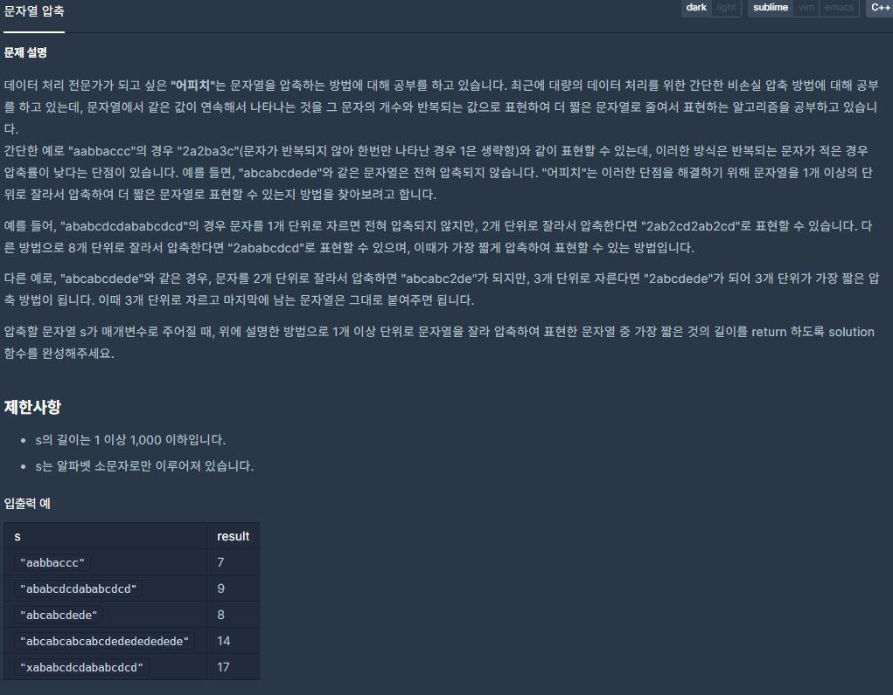
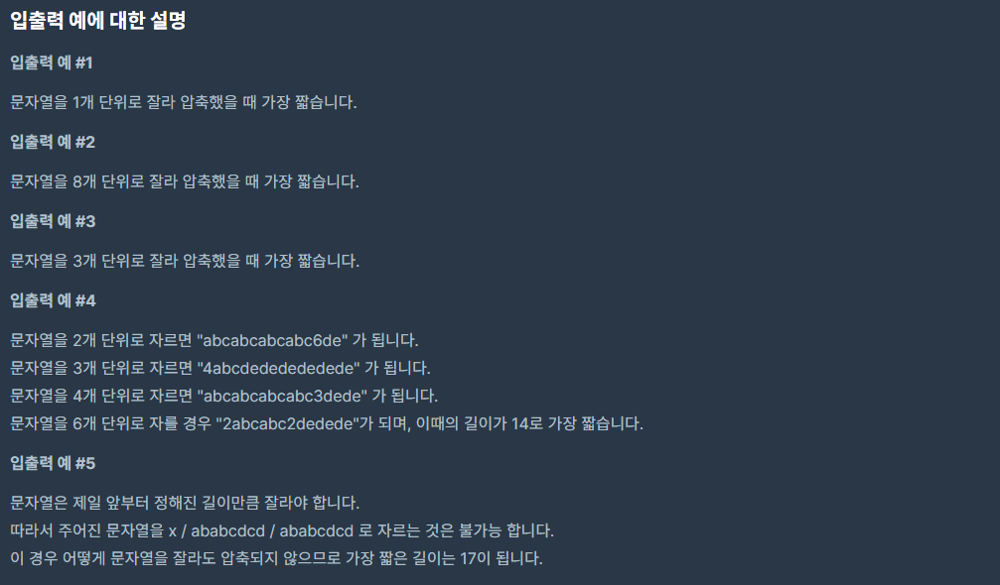

## [[Lv. 2] 문자열 압축](https://programmers.co.kr/learn/courses/30/lessons/60057)


___

## 💡 풀이
- 문제와 입출력 예를 통해 문제를 정확하게 이해하고 구현해야 한다.
- 문자열의 제일 앞부터 정해진 길이(1 ~ 문자열의 총 길이의 절반)만큼 자르면서, 최소로 압축되는 길이를 구하자.
    - 문자열의 총 길이의 절반일 때가 최대로 비교할 수 있는 마지노선이다.
- string 클래스의 `substr` 메소드와 `append` 메소드를 이용하여 구현하였다.
    - `s.substr(index, length)` : 문자열 s의 index부터 length만큼의 부분 문자열을 반환한다.
    - `s.append(string)` : 문자열 s의 뒤에 인자(string)를 붙인다.
- 구현 방법 주석 참고하기
___
```c++
#include <string>
#include <vector>

using namespace std;

int solution(string s) {
    if (s.size() == 1)
        return 1;
    
	string press = "";
	int answer = 1000;

	for (int i = 1; i <= s.size() / 2; i++) {
		for (int j = 0; j < s.size();) {
            // 단위(i)만큼 자르고 남은 나머지 문자열은 그대로 뒤에 붙인다.
			if (j + i >= s.size()) {
				press.append(s.substr(j, s.size() - j));
				break;
			}
            // 단위(i)만큼 자른 문자열들이 서로 같은 경우
			else if (s.substr(j, i) == s.substr(j + i, i)) {
				int idx = j + 2 * i;
				int cnt = 2;
                // 이후 문자열에서도 단위(i)만큼 잘랐을 때, 서로 같은 경우
				while (s.substr(j, i) == s.substr(idx, i)) {
					idx += i;
					cnt++;
				}
				press.append(to_string(cnt) + s.substr(j, i));
				j = idx;
			}
            // 단위(i)만큼 자른 문자열듷이 서로 다른 경우
			else {
				press.append(s.substr(j, i));
				j += i;
			}
		}
		if (press.size() < answer)
			answer = press.size();
		press.clear();
	}

    return answer;
}
```