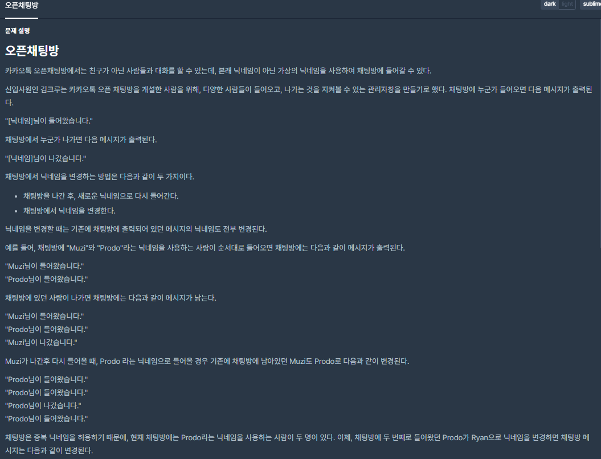
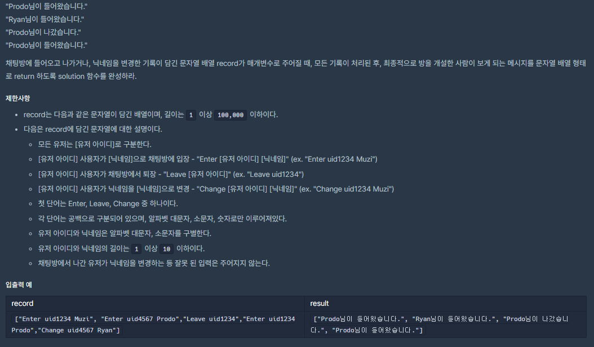

## [[Lv. 2] 오픈채팅방](https://programmers.co.kr/learn/courses/30/lessons/42888)


___

## 💡 풀이
- 문자열을 공백 단위로 구분하여 주어진 명령을 처리하는 문제이다.
    - 문자열을 공백 단위로 구분하는 것을 sstream(stringstream) 라이브러리를 이용하여 구현하였다.
- 유저가 오픈채팅방에 입장->퇴장->입장 했을 때, 닉네임이 바뀔 때 마다 이전 입퇴장 메세지의 닉네임도 변경시키기 위해, 유저 데이터를 유지해야 한다.
    - 오픈채팅방에 입장한 모든 유저를 map 자료구조를 이용하여 uid와 nickname으로 저장한다.
    - 이 때, 정렬된 상태로 저장할 필요가 없으므로 unordered_map을 사용한다.
___
```c++
#include <string>
#include <sstream>
#include <vector>
#include <unordered_map>

using namespace std;

vector<string> solution(vector<string> record) {
    vector<string> answer;
    unordered_map<string, string> users;
    vector<pair<string, string>> results;

    for (string r : record) {

        // 문자열 공백단위 구분
        //---------------------------------------------
        istringstream iss(r);
        string token, command, uid, nickname;
        int cnt = 0;
        while (getline(iss, token, ' ')) {
            if (cnt == 0)
                command = token;
            else if (cnt == 1)
                uid = token;
            else
                nickname = token;
            cnt++;
        }
        //---------------------------------------------

        // 작업 처리
        //---------------------------------------------
        if (command == "Enter") {
            // 이미 채팅방에 들어온 기록이 있으면(map에 데이터가 존재하면), 닉네임 수정
            if (users.find(uid) != users.end())
                users.find(uid)->second = nickname;
            // 채팅방에 처음 들어오는 경우, map에 저장
            else
                users.emplace(uid, nickname);
            // 결과 저장
            results.emplace_back(uid, "IN");
        }
        else if (command == "Leave")
            // 결과 저장
            results.emplace_back(uid, "OUT");
        else if (command == "Change")
            // 닉네임 수정
            users.find(uid)->second = nickname;
        //---------------------------------------------
    }

    // 결과 메세지화
    //-------------------------------------------------------
    for (auto& result : results) {
        string uid = result.first;
        string nickname = users.find(uid)->second;
        string action = result.second;
        
        if (action == "IN")
            answer.push_back(nickname + "님이 들어왔습니다.");
        else if (action == "OUT")
            answer.push_back(nickname + "님이 나갔습니다.");
    }
    //-------------------------------------------------------

    return answer;
}
```