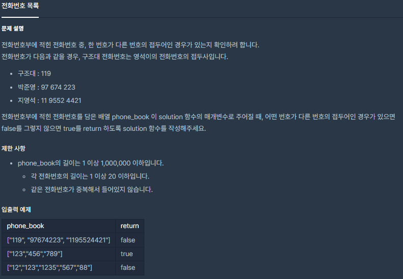
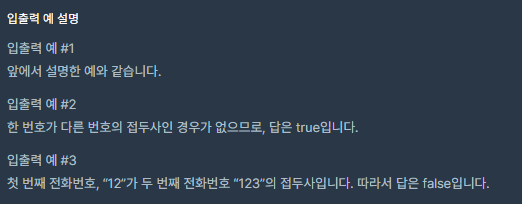

# [[Lv. 2] 전화번호 목록](https://programmers.co.kr/learn/courses/30/lessons/42577)



___
## 🤔접근
1. <b>각 전화번호의 길이가 N이라 했을 때, 부분 문자열(1 ~ N - 1)을 길이에 따라 접두어 배열에 저장하고, 전화번호를 하나씩 탐색하면서, 접두어 배열에 동일 번호가 존재하는지 찾아보자.</b>
___
## 💡풀이
- <B>알고리즘 & 자료구조</B>
	- `unordered_set`
- <b>구현</b>
	- `vector<unordered_set<string>> len(21)`에 길이에 따라 각 전화번호의 접두어(1 ~ N - 1)를 저장하였다.
	- 전화번호를 하나씩 탐색하면서, 동일 접두어가 존재하는지 체크하였다.
___
## ✍ 피드백
___
## 💻 핵심 코드
```c++
#include <string>
#include <vector>
#include <unordered_set>

using namespace std;

bool solution(vector<string> phone_book) {
	bool answer = true;
	vector<unordered_set<string>> len(21);

	for (auto number : phone_book) 
		for (int i = 0; i < number.size() - 1; i++) 
			len[i + 1].insert(number.substr(0, i + 1));

	for (auto number : phone_book) 
		if (len[number.size()].count(number))
			answer = false;	

	return answer;
}
```