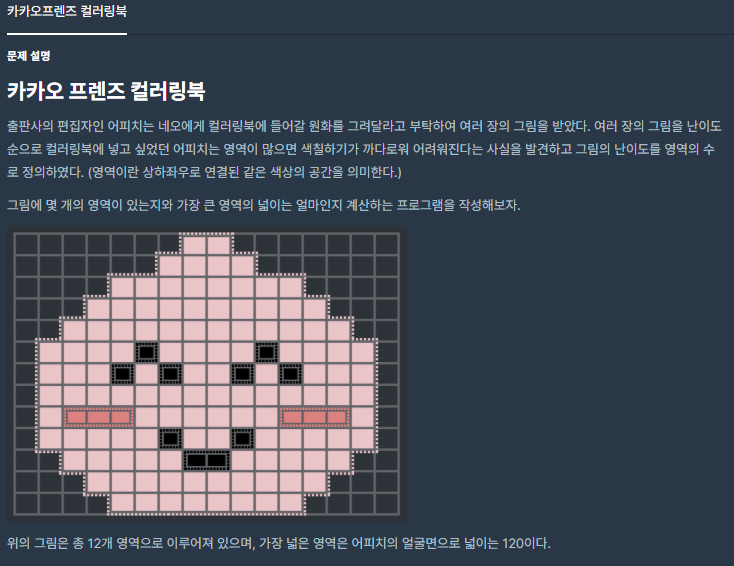
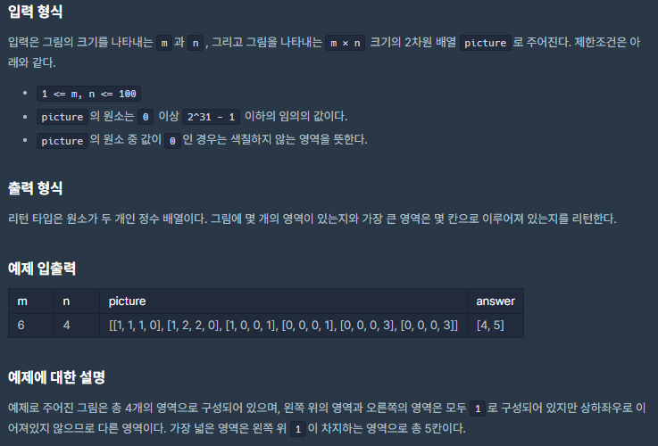

# [[Lv. 2] 카카오프렌즈 컬러링북](https://programmers.co.kr/learn/courses/30/lessons/1829#)



___
## 🤔접근
___
## 💡풀이
- <b>너비 우선 탐색(BFS) 알고리즘</b>을(를) 사용하였다.
	- 방문 여부와, 같은 색상 여부를 따지면서 4방향 탐색을 진행하자.
	- BFS 코드에서 같은 영역의 개수를 카운팅하고, BFS가 끝나면, 최대 영역 넓이를 갱신하고, 총 영역의 개수를 1 증가시키자.
___
## ✍ 피드백
___
## 💻 핵심 코드
```c++
#include <vector>
#include <queue>

using namespace std;

vector<int> solution(int m, int n, vector<vector<int>> picture) {
    int number_of_area = 0;
    int max_size_of_one_area = 0;
    vector<vector<bool>> isvisited(m, vector<bool>(n, false));
    queue<pair<int, int>> q;

    int dr[] = {0, 1, 0, -1};
    int dc[] = {1, 0, -1, 0};

    for (int i = 0; i < picture.size(); i++) {
        for (int j = 0; j < picture[i].size(); j++) {
            if (picture[i][j] == 0)
                continue;
            if (isvisited[i][j])
                continue;

            q.emplace(i, j);
            isvisited[i][j] = true;
            int cnt = 0;

            while (!q.empty()) {
                int row = q.front().first;
                int col = q.front().second;
                q.pop();
                cnt++;

                for (int dir = 0; dir < 4; dir++) {
                    int newRow = row + dr[dir];
                    int newCol = col + dc[dir];

                    if (newRow < 0 || newCol < 0 || newRow >= picture.size() || newCol >= picture.size())
                        continue;
                    if (picture[newRow][newCol] != picture[row][col] || isvisited[newRow][newCol])
                        continue;

                    q.emplace(newRow, newCol);
                    isvisited[newRow][newCol] = true;
                }
            }
            number_of_area++;
            max_size_of_one_area = max(max_size_of_one_area, cnt);
        }
    }

    vector<int> answer(2);
    answer[0] = number_of_area;
    answer[1] = max_size_of_one_area;
    return answer;
}
```