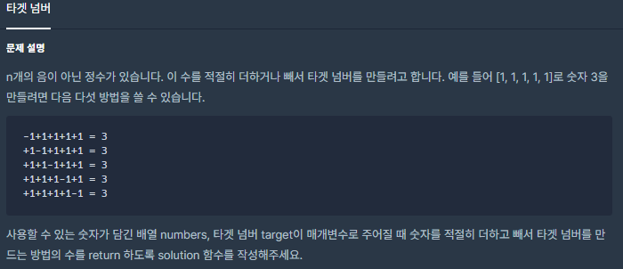
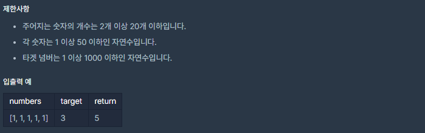

# [[Lv. 2] 타겟 넘버](https://programmers.co.kr/learn/courses/30/lessons/43165)



___
## 🤔접근
1. <b>n개의 정수에 각각 n개의 + 혹은 - 부호를 부여했을 때 타겟 넘버를 구할 수 있는 경우의 수를 찾아야 한다.</b>
	- DFS으로 모든 경우의 수를 탐색하자.
	- 최대 2²⁰번 연산이므로 충분히 빠르게 탐색이 가능하다.
___
## 💡풀이
- <b>깊이 우선 탐색(DFS) 알고리즘</b>을(를) 사용하였다.
__
## ✍ 피드백
___
## 💻 핵심 코드
```c++
#include <string>
#include <vector>

using namespace std;

int cnt = 0;
vector<int> seq;
int targetNum;

void DFS(int idx, int res){
    if (idx == seq.size()){
        if (res == targetNum)
            cnt++;
        return;
    }
    
    DFS(idx + 1, res + seq[idx]);
    DFS(idx + 1, res - seq[idx]);
}

int solution(vector<int> numbers, int target) {
    seq = numbers;
    targetNum = target;
    DFS(0, 0);
    
    return cnt;
}
```