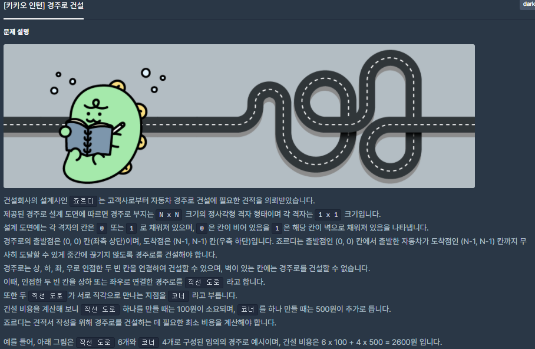
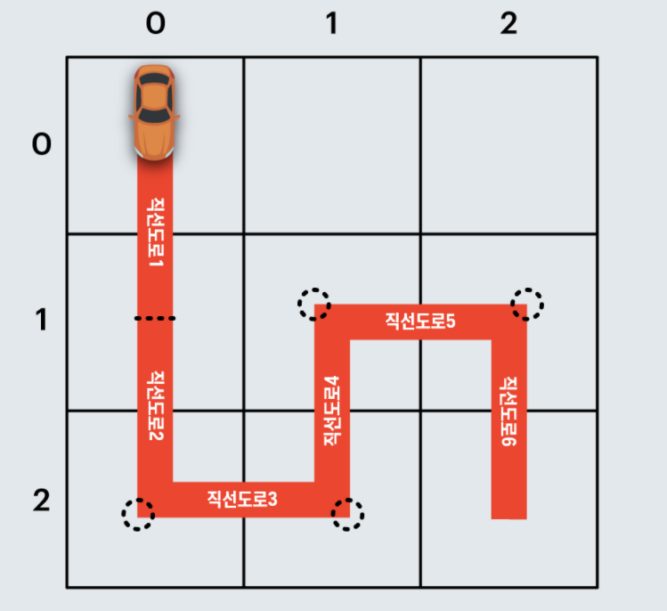
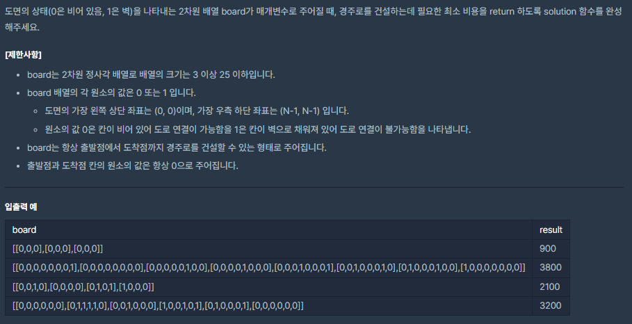
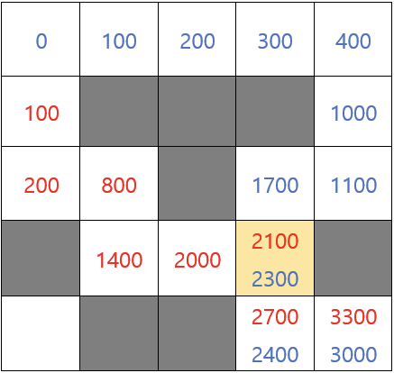

# [[Lv. 3] 경주로 건설](https://programmers.co.kr/learn/courses/30/lessons/67259)




___
## 🤔접근
1. <b>출발점에서 도착점까지 최소 비용으로 경주로를 건설해야 한다.</b>
	- 각 지점까지의 최소 비용을 저장하면서, 백트래킹 알고리즘을 이용하여 최소 비용 경주로를 구하자.
___
## 💡풀이
- <b>백트래킹(Backtracking) 알고리즘</b>을(를) 사용하였다.
	- 기본적인 전략으로는 4방향 탐색을 하면서 도착점 까지의 최소 비용을 구하는 것이다.
		- 인덱스 범위 이탈, 벽은 탐색 x
	- 직선 방향으로 도로를 건설할 때는 100원, 코너 방향으로는 코너 비용 + 도로 건설 비용으로 600원이 필요하다.
		- 출발 지점에서는 오른쪽, 아래 방향 모두 직선 방향으로 취급한다.
		- 출발 지점은 건설 비용이 0원, 나머지는 INF으로 기저 조건을 설정한다.
	- 위의 전략을 토대로 코드를 작성하기 위해, DFS의 매개변수로 (현재 위치, 현재 방향, 현재 비용)을 넘겨주어야 한다.
	- 메모이제이션할 DP에는 (현재 위치, 현재 위치로 온 방향, 최소 비용)을 저장해야 한다.
		- `dp[row][col][dir] = cost`
___
## ✍ 피드백
1. <b>문제를 풀 때, 항상 반례가 무엇이 있을지 생각하는 습관을 갖자❗</b>
	- 
	- 위의 그림을 보면, (3, 3)에서 문제가 발생한다는 것을 알 수 있다.
	- 빨간 경로로 오면 (3, 3)에서 파란 경로보다 최소 비용임으로 파란 경로가 무시된다.
		- 하지만, 최종 결과를 보면 파란 경로가 오히려 최소 비용임을 알 수 있다.
	- 이러한 문제를 해결하기 위해서는, (3, 3)에 들어오는 방향마다의 최소 비용을 따로 설정해 주어야 한다.
		- 그리고 최종 도착 지점에서 들어오는 방향마다의 값 중 최소 값을 선택하면 된다.
___
## 💻 핵심 코드
```c++
#include <string>
#include <vector>
#include <algorithm>
#include <cmath>

using namespace std;

#define MAX 25 * 25 * 500
#define WALL 1
#define UP 0
#define RIGHT 1
#define DOWN 2
#define LEFT 3

int N;
vector<vector<vector<int>>> dp;
vector<vector<int>> map;
int dr[] = {-1, 0, 1, 0};
int dc[] = {0, 1, 0, -1};

void DFS(int row, int col, int curDir, int cost) {
	if (row == N - 1 && col == N - 1)
		return;

	for (int dir = 0; dir < 4; dir++) { // 4방향 탐색
		int newRow = row + dr[dir];
		int newCol = col + dc[dir];

		if (newRow < 0 || newRow >= N || newCol < 0 || newCol >= N) // 인덱스 범위 이탈
			continue;
		if (map[newRow][newCol] == WALL) // 이동하려는 위치: 벽
			continue;

		if (abs(curDir - dir) == 2 || abs(curDir - dir) == 0) { // 이동 방향: 직선
			if (dp[newRow][newCol][dir] > cost + 100) {
				dp[newRow][newCol][dir] = cost + 100;
				DFS(newRow, newCol, dir, cost + 100);
			}
		}
		else { // 이동 방향: 코너
			if (dp[newRow][newCol][dir] > cost + 600) {
				dp[newRow][newCol][dir] = cost + 600;
				DFS(newRow, newCol, dir, cost + 600);
			}
		}
	}
}

int solution(vector<vector<int>> board) {
	int answer = 0;

	dp.assign(board.size(), vector<vector<int>>(board.size(), vector<int>(4, MAX)));
	map = board;
	N = board.size();

	for (int i = 0; i < 4; i++)
		dp[0][0][i] = 0;

	// dp[r][c][dir]: dir방향으로 (r, c)에 도착했을 때의 최소 비용
	dp[0][1][RIGHT] = dp[1][0][DOWN] = 100; // base condition: 시작 위치에서는 두 방향 모두 직선 방향으로 취급

	// 오른쪽, 아래 방향으로 각각 탐색
	if (board[0][1] != WALL)
		DFS(0, 1, RIGHT, 100);
	if (board[1][0] != WALL)
		DFS(1, 0, DOWN, 100);

	answer = min({dp[N - 1][N - 1][UP], dp[N - 1][N - 1][RIGHT], dp[N - 1][N - 1][DOWN], dp[N - 1][N - 1][LEFT]});

	return answer;
}
```