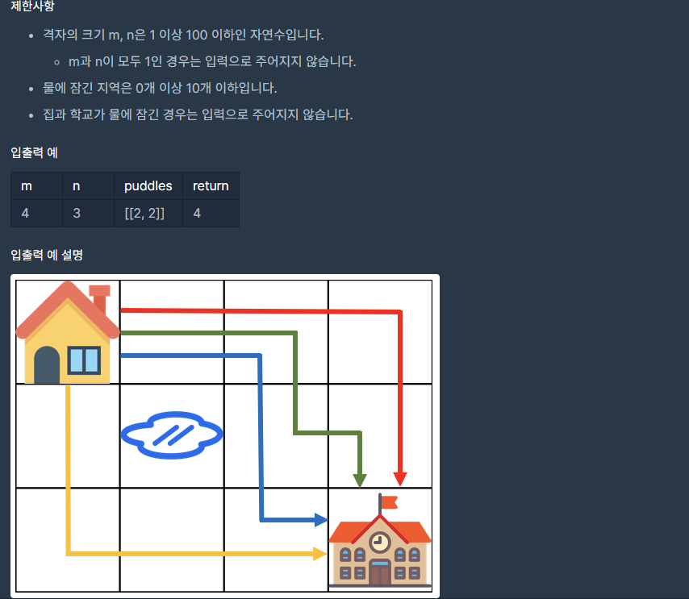

## [[Lv. 3] 등굣길](https://programmers.co.kr/learn/courses/30/lessons/42898)


___

## 💡 풀이
- 동적계획법으로 해결하였다.
- DFS으로도 해결할 수 있지만, 중복으로 방문하는 지역이 매우 많아 비효율적이다.
- 아이디어는 다음과 같다.
    - 오른쪽과 아래로만 이동할 수 있으므로, 출발 장소에서 현재 지역의 윗 지역과 왼쪽 지역까지 도달할 수 있는 각각의 경우의 수의 합이 현재 장소까지 도달할 수 있는 총 경우의 수이다.
    - 물이 고인 지역은 방문하지도, 경우의수에 더하지도 않음에 주의하자.
___
```c++
#include <string>
#include <vector>

using namespace std;

int solution(int m, int n, vector<vector<int>> puddles) {
    int answer = 0;
    // 이차원 벡터 할당
    vector<vector<int>> dp(n, vector<int>(m, 0));
    
    // 출발 장소의 경우의 수는 1로 설정
    dp[0][0] = 1;
    // 물이 고인 지역 설정
    for (int i = 0; i < puddles.size(); i++) {
        int r = puddles[i][1] - 1;
        int c = puddles[i][0] - 1;
       dp[r][c] = -1;
    }

    for (int i = 0; i < n; i++) {
        for (int j = 0; j < m; j++) {
            // 출발장소는 생략
            if (i == 0 && j == 0)
                continue;
            // 현재 지역이 물이 고인 지역이 아니라면
            if (dp[i][j] != -1) {
                int left = 0;
                int top = 0;

                // 윗 지역이 격자 이내 & 물이 고인 지역이 아니라면
                if (i > 0 && dp[i - 1][j] != -1)
                    top = dp[i - 1][j];
                // 왼쪽 지역이 격자 이내 & 물이 고인 지역이 아니라면
                if (j > 0 && dp[i][j - 1] != -1)
                    left = dp[i][j - 1];

                // 현재 지역까지 도달하는 경우의 수는 left + top
                dp[i][j] = (left + top) % 1000000007;
            }
        }
    }

    answer = dp[n-1][m-1];
    
    return answer;
}
```