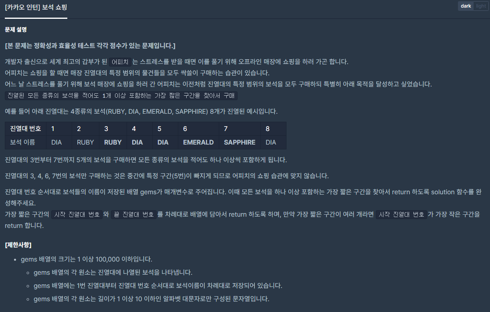

## [[Lv. 3] 보석 쇼핑](https://programmers.co.kr/learn/courses/30/lessons/67258#)


___

## 💡 풀이
- Two Pointer 방식을 이용하여 해결할 수 있다.
    - STL set을 이용하여, 중복x인 보석의 총 개수를 구한다.
    - 다음으로, 두 개의 포인터(left, right)가 첫 번째 인덱스를 가리키도록 설정한다.
    - 보석을 하나씩 집을 때 마다, unordered_map에 저장한다.
        - 만약, map의 원소 개수가 서로 다른 보석의 총 개수와 같다면
            - right - left가 answer에 저장된 것 보다 더 짧은 구간이라면, 갱신한다.
            - 가장 먼저 집은 보석(left)을 map에서 제거하고, left pointer를 1 증가시킨다.
        - 만약, map의 원소 개수가 서로다른 보석의 총 개수보다 적다면
            - right pointer가 인덱스 범위를 벗어난 경우, 반복문 탈출
            - right pointer를 1 증가시키고, 해당 위치에 있는 보석을 map에 저장한다.
___
```c++
#include <string>
#include <vector>
#include <unordered_map>
#include <set>

using namespace std;

vector<int> solution(vector<string> gems) {
    vector<int> answer(2);
    set<string> gems_list;
    // 현재 들고있는 보석들을 저장하는 자료구조
    // <보석 이름, 보석 개수>
    unordered_map<string, int> m;
    
    int left = 0, right = 0, gems_cnt;
    int len = gems.size();
    
    answer[0] = 0;
    answer[1] = len - 1;
    
    for(int i=0; i<len; i++)
        gems_list.insert(gems[i]);
    gems_cnt = gems_list.size();
    
    m[gems[0]]++;
    while(true){
        if(m.size() == gems_cnt){
            if(answer[1] - answer[0] > right - left){
                answer[0] = left;
                answer[1] = right;
            }

            m[gems[left]]--;
            if(m[gems[left]] == 0)
                m.erase(gems[left]);
            left++;       
        }
        else if(m.size() < gems_cnt){
            if(right + 1 >= len)
                break;
            else
                m[gems[++right]]++;
        }
    }
    
    answer[0]++;
    answer[1]++;
    
    return answer;
}
```