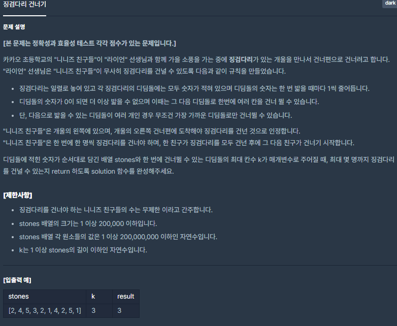
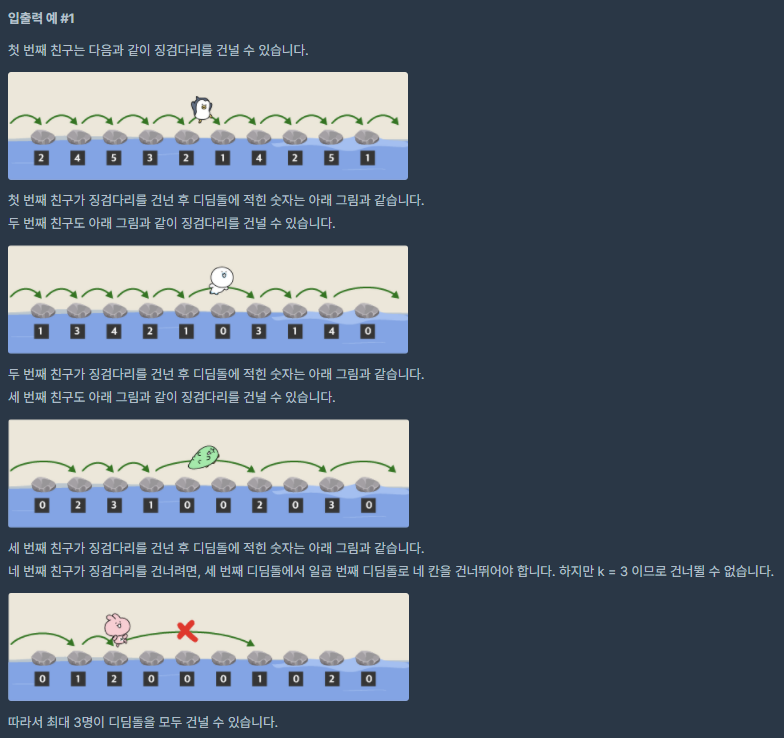

# [[Lv. 3] 징검다리 건너기](https://programmers.co.kr/learn/courses/30/lessons/64062)



___
## 🤔접근
1. <b>돌다리 개수 N과 k는 최대 20만이다. 단순히 하나씩 탐색한다면, O(200,000²)으로 TLE을 피할 수 없다.</b>
	- O(1차 + 1차) 혹은 O(1차 * 로그) 정도의 알고리즘을 사용해야 한다.
2. <b>탐욕 알고리즘을 사용할 수 있을까?</b>
	- 돌다리를 하나씩 탐색하면서, 각 연속하는 k개의 돌다리에 대한 데이터와 이 중 최대값을 보관하면서, 이 값들 중 가장 최솟값을 찾아야 한다.
	- 돌다리를 하나씩 탐색해야하므로, O(N * ?) 형태가 되고, ?은 반드시 1차 이하이어야 한다.
	- 삽입, 삭제, 탐색 모두 로그 시간 이내로 수행하고, 항상 정렬된 상태를 유지할 수 있는 자료구조가 필요하다.
	- Red-Black tree로 구현한 자료구조 Map은 삽입, 삭제가 로그 시간으로 가능하며, 항상 정렬된 상태를 유지한다.<br>
	또한, 가장 큰 값을 O(1)에 탐색할 수 있다.
3. <b>이분 탐색 알고리즘은 어떨까?</b>
	- 이분 탐색 알고리즘은 오름차순으로 정렬된 리스트에서 `원하는 값을 로그 시간 이내로 찾아`낼 수 있는 알고리즘이다.
	- 돌다리의 순서를 바꿀 수는 없으므로, 사용할 수 없는 걸까?
	- 발상을 전환해보자.
		- 이 문제에서 원하는 것은, 임의의 값을 찾는 것이 아닌, 연속으로 k개의 돌다리를 선택했을 때, 이 연속되는 값 중 최댓값을 찾고, 이 모든 경우의 각 최댓값 중에서 `최솟값을 찾는 것`이다.
		- 즉, k개의 연속되는 값 중 최댓값을 이분 탐색으로 범위를 좁혀나가면서 N개의 돌다리를 탐색하다보면, 그 중 최솟값을 찾을 수 있을 것이다.
___
## 💡풀이
- <b>탐욕(Greedy) 알고리즘, 맵(Map) 자료구조</b>을(를) 사용하였다.
	- map에 돌다리의 숫자와 인덱스를 담는다.
		- 이 데이터들은 내림차순으로 정렬되기 때문에, 인덱스는 음수로 저장하자.
	- map에 인덱스 i부터 총 개수까지 각 k개의 돌다리의 데이터를 담고, 가장 큰 값(*--m.end())을 빼내어 answer과 비교하여 최솟값을 answer에 저장한다.
	- 또한, 가장 왼쪽의 돌다리를 map에서 제거한다.
		- `m.erase(m.find(stones[i - k]))`
- <b>이분 탐색(Binary Search) 알고리즘</b>을 이용하여도 해결할 수 있다.
	- low값은 0, high값은 돌다리의 숫자 중 가장 큰 값을 저장한다.
	- low가 high값을 초과할 때까지 아래의 작업을 반복한다.
		- mid = (low + high0/ 2이라 할 때, 돌다리를 처음부터 끝까지 탐색하면서, mid값 이하인 돌다리가 연속해서 k개 붙어있으면, answer에 mid값을 저장한다.
			- 만약 위 조건을 만족하는 길이가 k 이상일 때는 high 값을 mid - 1으로 설정한다.
			- 그렇지 않다면, low 값을 mid + 1으로 설정한다. 
___
## ✍ 피드백
___
## 💻 핵심 코드
```c++
// Solution 1: Greedy + Map
#include <string>
#include <vector>
#include <map>

using namespace std;

int solution(vector<int> stones, int k) {
	int answer = 1e9;

	multimap<int, int> m; // sorting: O(nlogn) / indexing: O(1)
	int _size = stones.size(); // O(200,000)
	int len = k; // O(200,000)

	for (int i = 0; i < len; i++) // [0, k)
		m.emplace(stones[i], -i);
	auto iter = m.end();
	answer = min(answer, (*--iter).first);

	for (int i = len; i < _size; i++) { // [k, stones.size)
		iter = m.find(stones[i - len]);
		m.erase(iter);
		m.emplace(stones[i], -i);

		iter = m.end();
		answer = min(answer, (*--iter).first);
	}

	return answer;
}
```
```c++
// Solution 2: Binary Search
#include <string>
#include <vector>
#include <algorithm>

using namespace std;

int solution(vector<int> stones, int k) {
	int answer = 0;
    int start = 0;
    int end = *max_element(stones.begin(), stones.end());

    while (start <= end) { // O(log₂(200,000,000))
        int mid = (start + end) / 2;
        int cnt = 0;
        int len = 0;

        for (int i = 0; i < stones.size(); i++) { // O(200,000)
            if (stones[i] <= mid)
                len = max(len, ++cnt);
            else
                cnt = 0;
        }

        if (len >= k) {
            answer = mid;
            end = mid - 1;
        }
        else
            start = mid + 1;
    }

    return answer; // O(200,000 * 27)
}
```