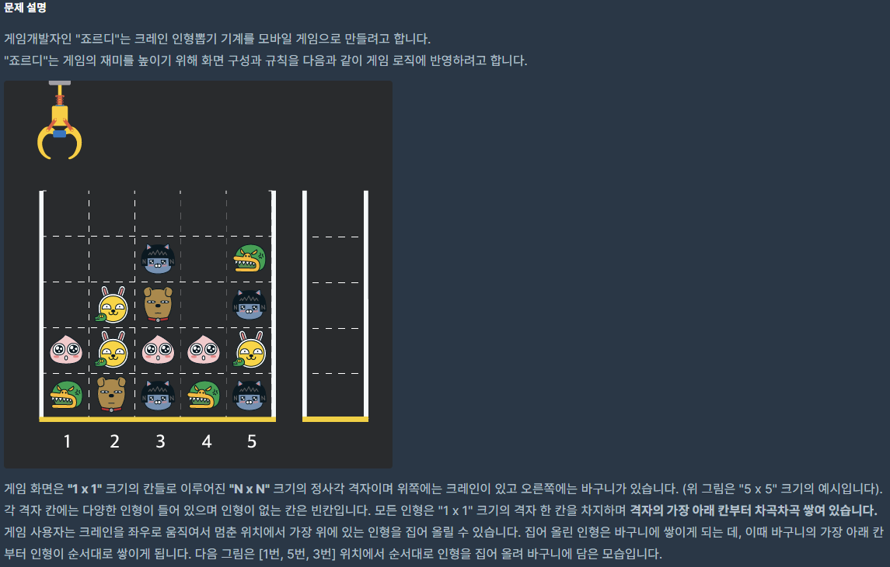
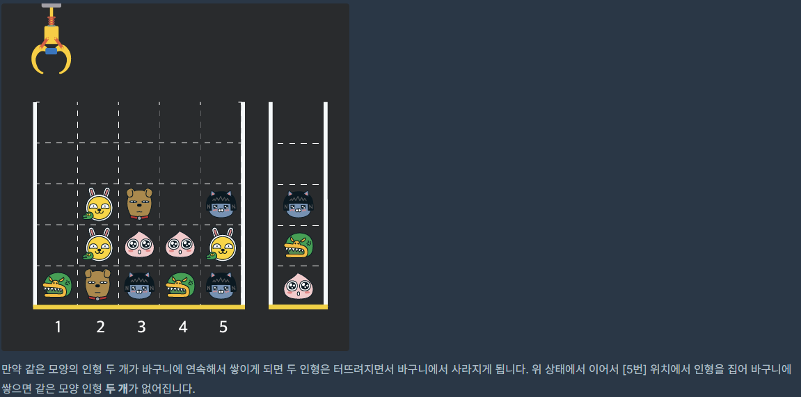
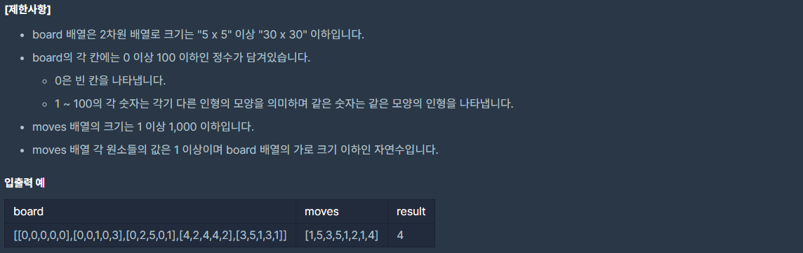

## [[Lv. 3] 크레인 인형뽑기 게임](https://programmers.co.kr/learn/courses/30/lessons/64061)



___

## 💡 풀이
- 2019 카카오 개발자 겨울 인턴쉽 문제 중 하나인데, 바구니를 `stack`이라 생각하고 풀면 간단하다.
___
```c++
#include <string>
#include <vector>
#include <stack>

using namespace std;

int solution(vector<vector<int>> board, vector<int> moves) {
    int answer = 0;
    stack<int> s;
    
    for(int m : moves){
        for(int i=0; i<board.size(); i++){
            if(board[i][m - 1]){
                if(!s.empty() && s.top() == board[i][m - 1]){
                    s.pop();
                    answer += 2;
                }
                else
                    s.push(board[i][m - 1]);
                board[i][m - 1] = 0;
                break;
            }
        }
    }
    
    return answer;
}
```