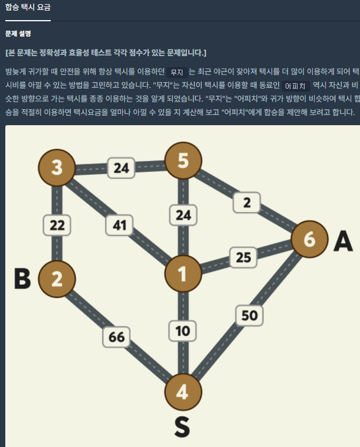
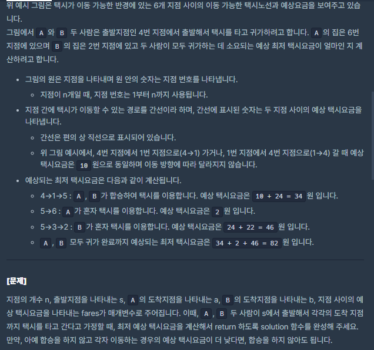
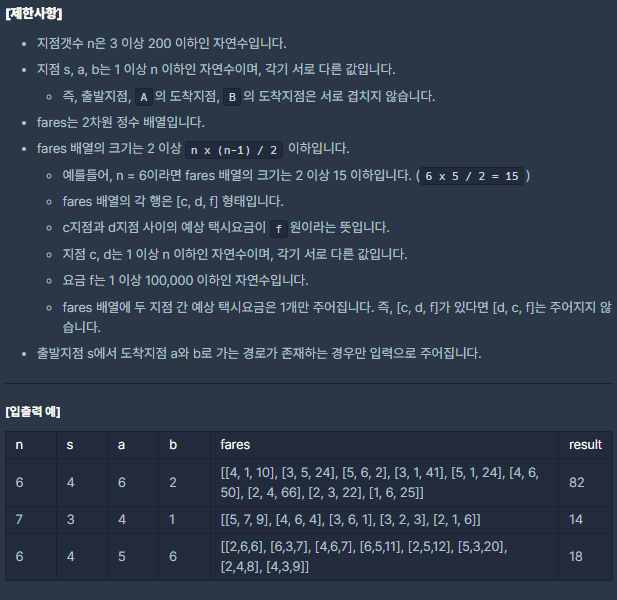

# [[Lv. 3] 합승 택시 요금](https://programmers.co.kr/learn/courses/30/lessons/72413)




___
## 🤔접근
1. <b>각 정점을 한 번씩 합승으로 도착한 정점으로 설정하고, 이 정점에서 각각 A와 B로 이동한 비용을 더한 값들의 최솟값을 찾자.</b>
___
## 💡풀이
- <B>알고리즘 & 자료구조</B>
	- `Dijkstra`
	- `Brute Force`
- <b>구현</b>
	- 각 정점을 한 번씩 합승 도착 지점으로 설정하고, 이 정점에서 A와 B로 이동하는 비용을 모두 구해봐야 최솟값을 구할 수 있다.
	- 최소 이동 비용은 다익스트라 알고리즘을 이용하여 구할 수 있다.
	- 시작 정점에서 모든 정점(합승 도착 지점)으로의 비용을 미리 구해 놓고, 합승 도착 지점을 첫 번째 정점부터 마지막 정점까지 한 번씩 설정하고, 이 정점으로부터 A와 B로 이동하는 최소 비용을 구하였다.
___
## ✍ 피드백
___
## 💻 핵심 코드
```c++
#include <string>
#include <vector>
#include <queue>

using namespace std;

vector<int> Dijkstra(const vector<vector<pair<int, int>>>& adj, const int& n, const int& src) {
    vector<int> costs(n + 1, 1e8);
    priority_queue<pair<int, int>, vector<pair<int, int>>, greater<pair<int, int>>> pq;

    costs[src] = 0;
    pq.emplace(0, src);
    while (!pq.empty()) {
        int curCost = pq.top().first;
        int curCity = pq.top().second;
        pq.pop();

        if (costs[curCity] < curCost)
            continue;

        for (auto next : adj[curCity]) {
            int nextCity = next.first;
            int weight = next.second;
            if (costs[nextCity] > curCost + weight) {
                costs[nextCity] = curCost + weight;
                pq.emplace(costs[nextCity], nextCity);
            }
        }
    }

    return costs; 
}

int solution(int n, int s, int a, int b, vector<vector<int>> fares) {
    int answer = 1e8;

    vector<vector<pair<int, int>>> adj(n + 1);
    for (auto fare : fares) {
        adj[fare[0]].emplace_back(fare[1], fare[2]);
        adj[fare[1]].emplace_back(fare[0], fare[2]);
    }

    // [시작 지점 -> 모든 지점(합승 해산 지점)] 택시 요금
    vector<int> startToSharedRideDests = Dijkstra(adj, n, s);
    for (int sharedRideDest = 1; sharedRideDest <= n; sharedRideDest++) {
        // [합승 해산 지점 -> A & B] 택시 요금
        vector<int> sharedRideDestToAB = Dijkstra(adj, n, sharedRideDest);
        
        answer = min(answer, startToSharedRideDests[sharedRideDest] + sharedRideDestToAB[a] + sharedRideDestToAB[b]);
    }

    return answer;
}
```