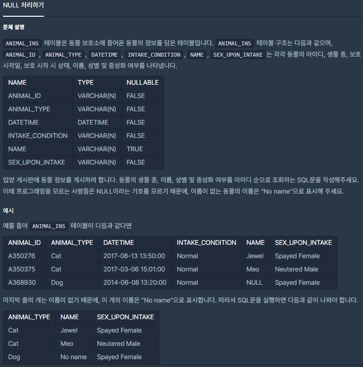

## [[SQL] NULL 처리하기](https://programmers.co.kr/learn/courses/30/lessons/59410(NULL))

___

## 💡 풀이
- MySQL에서 Column의 값이 `Null`인 경우를 처리해주는 함수들은 `IFNULL`, `CASE`, `COALESCE`와 같은 함수들이 있다.
### IFNULL
- <b>해당 Column의 값이 NULL을 반환할 때, 다른 값으로 출력할 수 있도록 하는 함수</b><br><br>
- <B>기본 구조</B>
```sql
SELECT IFNULL(Column명, "Null일 경우 대체 값") FROM 테이블명;
```
### IF
- Null 처리는 사실 `IF` 함수와 `IS NULL` 조건으로도 가능하다.<br><br>
- <b>기본 구조</b>
```sql
SELECT IF(IS NULL(Column명), "Null일 경우 대체 값", Column명(`Null이 아닐 경우 출력 할 컬럼`)) FROM 테이블명;
```
### CASE
- <b>해당 Column 값을 조건식을 통해 True, False를 판단하여, 조건에 맞게 Column 값을 변환할 때 사용하는 함수</b><br><br>
- <b>기본 구조</b>
```sql
CASE 
    WHEN 조건식1 THEN 식1
    WHEN 조건식2 THEN 식2
    ...
    ELSE 조건에 맞는경우가 없는 경우 실행할 식
END
```
- 예시
```sql
SELECT 
    CASE
        WHEN NAME IS NULL THEN "No name"
        ELSE NAME
    END as NAME
FROM ANIMAL_INS
```
### COALESCE
- <b>COALESCE는 지정한 표현식들 중에 NULL이 아닌 첫 번째 값을 반환한다.</b><br><br>
- <b>기본 구조</b>
```sql
// NULL 처리 상황
SELECT COALESCE(Column명1, Column명1이 NULL인 경우 대체할 값)
FROM 테이블명
```
```sql
// 배타적 OR 관계 열
// Column1 ~ 4 중 NULL이 아닌 첫 번째 Column을 출력
SELECT COALESCE(Column명1, Column명2, Column명3, Column명4)
FROM 테이블명
```
___
## ✍ 피드백
___
## 💻 코드
```sql
SELECT ANIMAL_TYPE, IFNULL(NAME, "No name"), SEX_UPON_INTAKE FROM ANIMAL_INS order by ANIMAL_ID
```