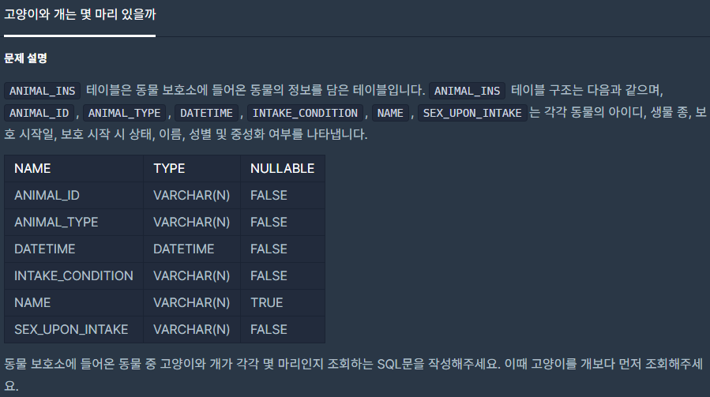
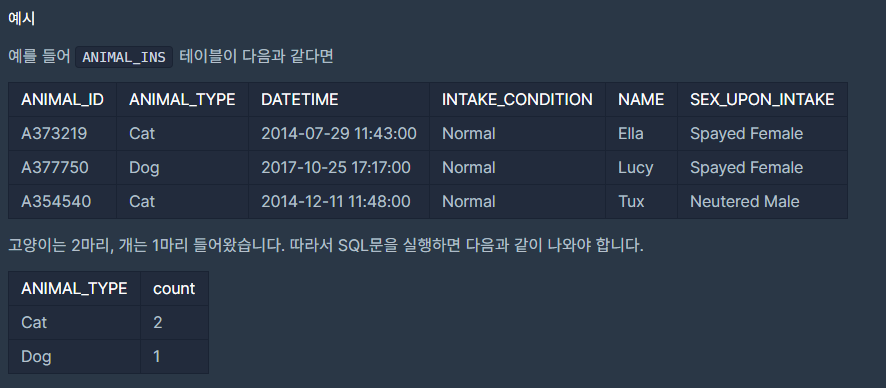

## [[SQL] 고양이와 개는 몇 마리 있을까](https://programmers.co.kr/learn/courses/30/lessons/59040(%EA%B3%A0%EC%96%91%EC%9D%B4%EC%99%80))


___

## 💡 풀이
- count 함수 인자로 컬럼 명을 넣으면, 해당 컬럼에 존재하는 개수를 반환하며, as절을 통해 출력되는 컬럼 명을 설정할 수 있다.
- group by절을 사용하여 데이터들을 원하는 그룹으로 나눌 수 있다.
    - 나누고자 하는 그룹의 컬럼명을 select절과 group by절 뒤에 추가하면 된다.
___
```sql
SELECT ANIMAL_TYPE, count(ANIMAL_TYPE) as count FROM ANIMAL_INS group by ANIMAL_TYPE order by ANIMAL_TYPE
```