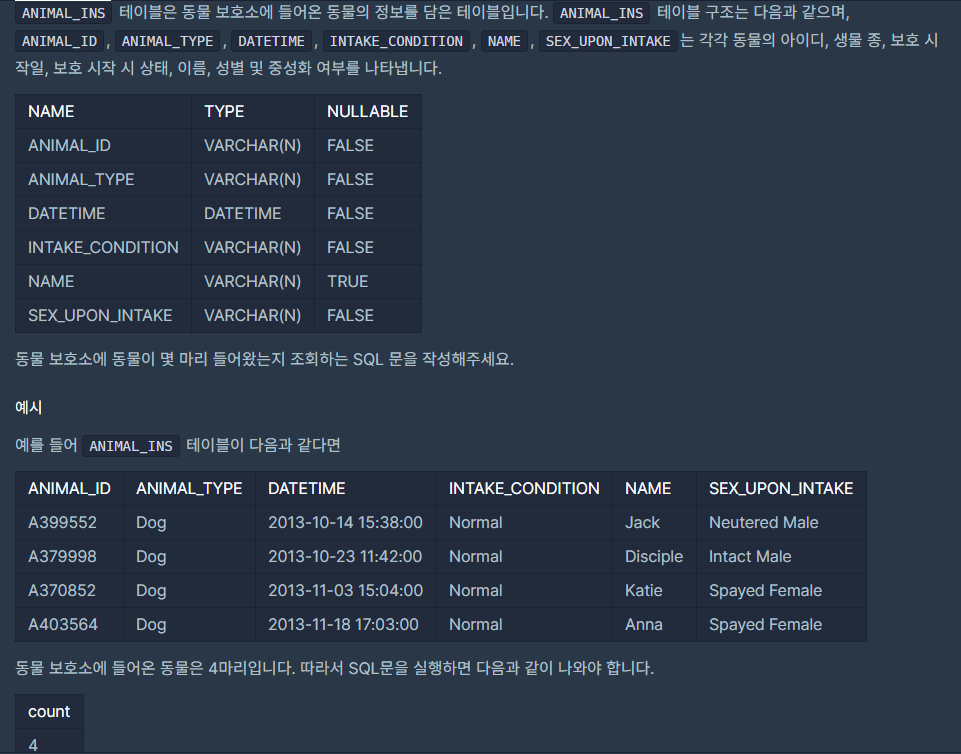

## [[SQL] 동물 수 구하기](https://programmers.co.kr/learn/courses/30/lessons/59406(%EB%8F%99%EB%AC%BC)

___

## 💡 풀이
- select 문에서 집계함수(count, sum, ...)를 사용할 수 있다.
- 총 동물의 마리수를 구해야 하므로, 전체 column의 count를 구하며 ㄴ된다.
___
```sql
SELECT count(*) from ANIMAL_INS
```