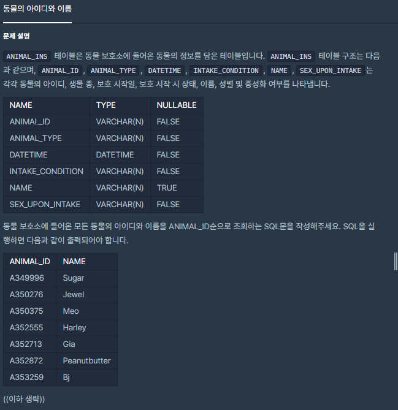

## [[SQL] 동물의 아이디와 이름](https://programmers.co.kr/learn/courses/30/lessons/59403(%EB%8F%99%EB%AC%BC%EC%9D%98)

___

## 💡 풀이
- order by 키워드를 이용하여 ANIMAL_ID 순으로 오름차순 정렬한 결과를 확인할 수 있다.
___
## ✍ 피드백
___
```sql
SELECT ANIMAL_ID, NAME FROM ANIMAL_INS order by ANIMAL_ID
```