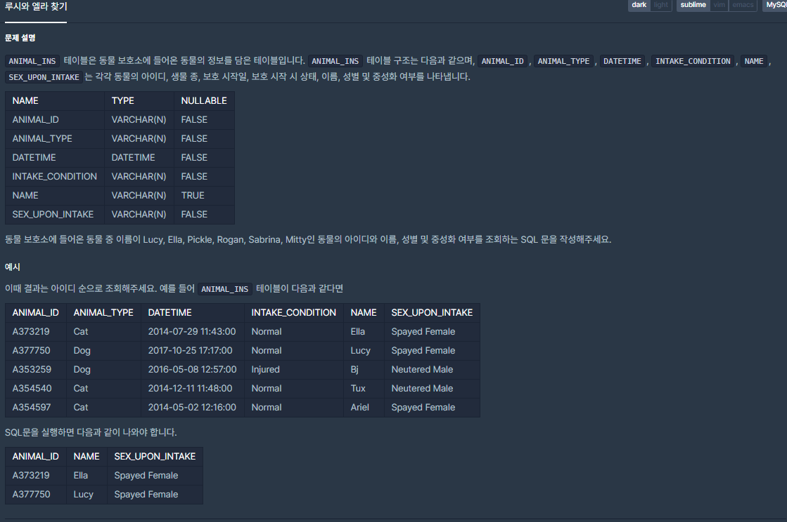

## [[SQL] 루시와 엘라 찾기](https://programmers.co.kr/learn/courses/30/lessons/59046)

___

## 💡 풀이
- WHERE 절에 IN 키워드를 사용하여 여러 조건 검사를 한 번에 실시한다.
___
```sql
SELECT ANIMAL_ID, NAME, SEX_UPON_INTAKE 
FROM ANIMAL_INS 
WHERE NAME In ('Lucy', 'Ella', 'Pickle', 'Rogan', 'Sabrina', 'Mitty')
ORDER BY ANIMAL_ID ASC
```