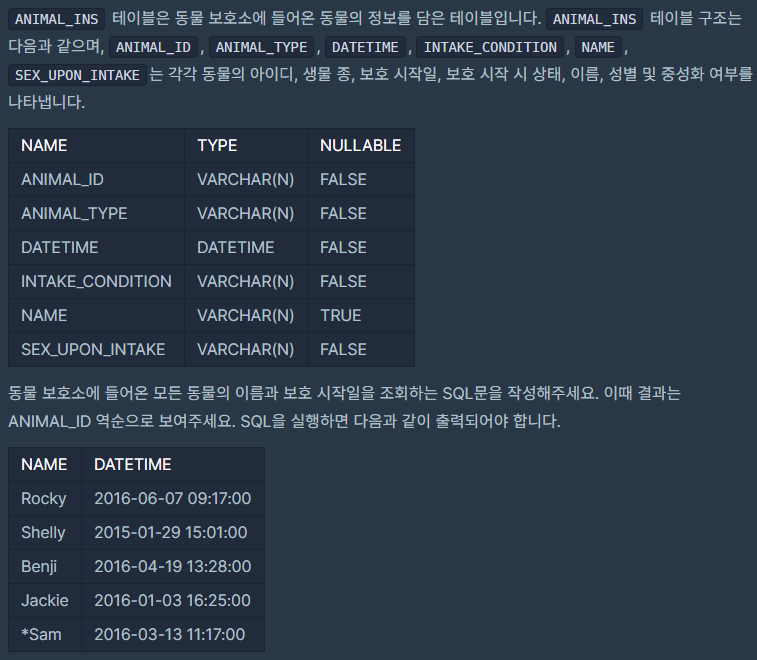

## [[SQL]] 역순 정렬하기](https://programmers.co.kr/learn/courses/30/lessons/59035)
<br>
<br>
___

## 💡 풀이
- 특정 attribute로 오름차순으로 정렬하는 키워드는 `order by`이고, 내림차순으로 정렬하려면 `desc` 키워드를 뒤에 추가해주면 된다.
___
```sql
SELECT name, datetime from animal_ins order by animal_id desc
```