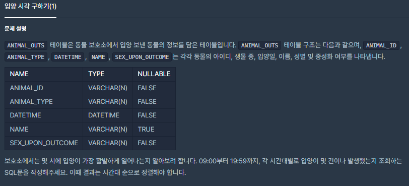
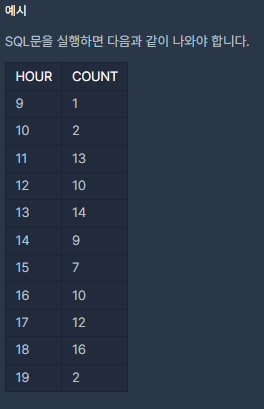

# [[SQL] 입양 시각 구하기(1)](https://programmers.co.kr/learn/courses/30/lessons/59412)



___
## 🤔접근
___
## 💡풀이
- <B>HOUR, COUNT, DATE_FORMAT, BETWEEN, GROUP BY, ORDER BY 함수</B>을(를) 사용하였다.
	- <b>날짜, 시간 관련 함수</b>
		- `YEAR(date)`
		- `MONTH(date)`
		- `WEEK(date)`
		- `HOUR(time)`
		- `MINUTE(time)`
		- `SECOND(time)`
		- ...
	- <b>DATE_FORMAT(date, format)</b>
		- `%Y`: year (4digits)
		- `%y`: year (2digits)
		- `%H`: hour (00 ~ 23)
		- `%h`: hour (01 ~ 12)
		- `%i`: minute (00 ~ 59)
		- ...
	- <b>GROUP BY</b>
		- HOUR 함수로 얻은 값을 그룹으로 묶어 중복 값을 제거해주고, COUNT 함수에 의해 계산된 row 개수를 얻을 수 있음
		- 단순히 COUNT 함수만 사용하면, 전체 개수만을 가져오게 된다.
___
## ✍ 피드백
___
## 💻 핵심 코드
```sql
SELECT HOUR(DATETIME) AS HOUR, COUNT(*) AS COUNT 
FROM ANIMAL_OUTS 
WHERE DATE_FORMAT(DATETIME, '%H:%i') BETWEEN '09:00' AND '19:59' 
GROUP BY HOUR 
ORDER BY HOUR
```