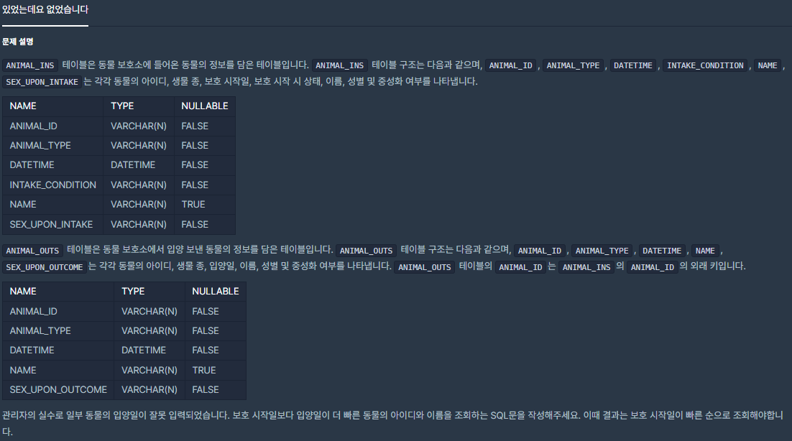
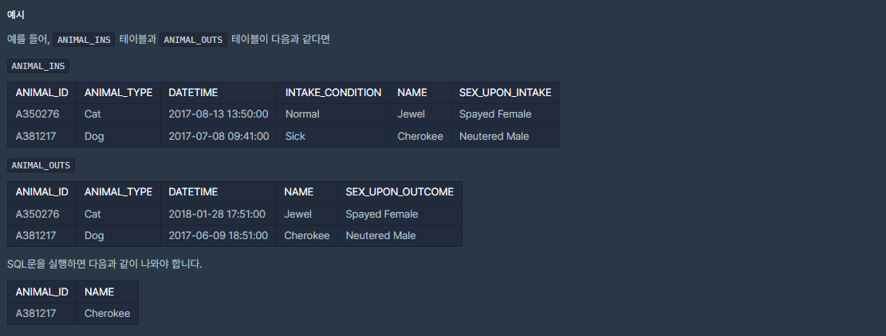

# [[SQL] 있었는데요 없었습니다](https://programmers.co.kr/learn/courses/30/lessons/59043(%EC%9E%88%EC%97%88%EB%8A%94%EB%8D%B0%EC%9A%94))



___
## 🤔접근

___
## 💡풀이
- 먼저, `JOIN`을 이용하여 두 테이블의 PK가 같은 컬럼들만 모은 뒤, `WHERE`절에서 보호 시작일이 빠른 컬럼들을 걸러내었다.
___
## ✍ 피드백
___
## 💻 핵심 코드
```sql
SELECT INS.ANIMAL_ID AS ANIMAL_ID, INS.NAME AS NAME
FROM ANIMAL_INS INS
LEFT JOIN ANIMAL_OUTS OUTS
ON OUTS.ANIMAL_ID = INS.ANIMAL_ID
WHERE OUTS.DATETIME < INS.DATETIME
ORDER BY INS.DATETIME
```