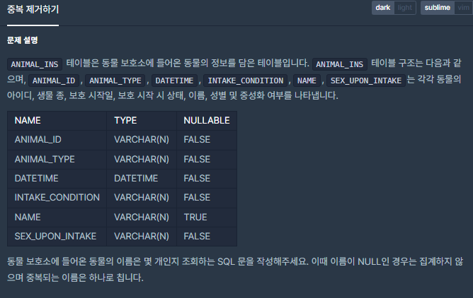
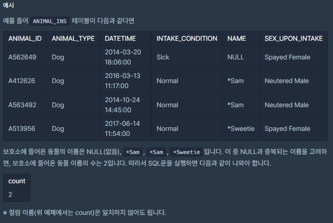

# [[SQL] 중복 제거하기](https://programmers.co.kr/learn/courses/30/lessons/59408(%EC%A4%91%EB%B3%B5))



___
## 🤔접근
___
## 💡풀이
- <b>DISTINCT, COUNT 키워드</b>을(를) 사용하였다.
	- `DISTINCT` 키워드를 사용하면, 중복 값과 NULL 값을 제외한 값들을 보여준다.
	- 여기에 `COUNT` 키워드를 사용하여 중복, NULL을 제외한 동물의 이름 개수를 구하면 된다.
___
## ✍ 피드백
___
## 💻 핵심 코드
```sql
SELECT COUNT(DISTINCT NAME) as count FROM ANIMAL_INS
```