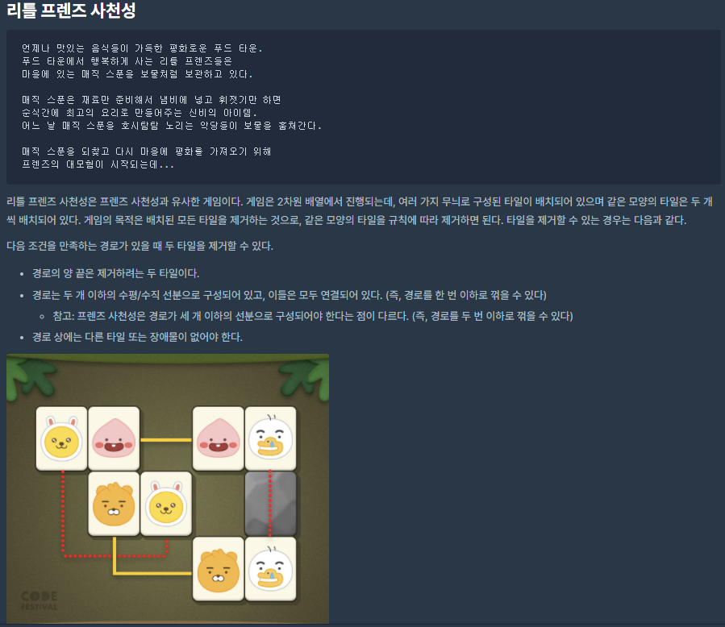
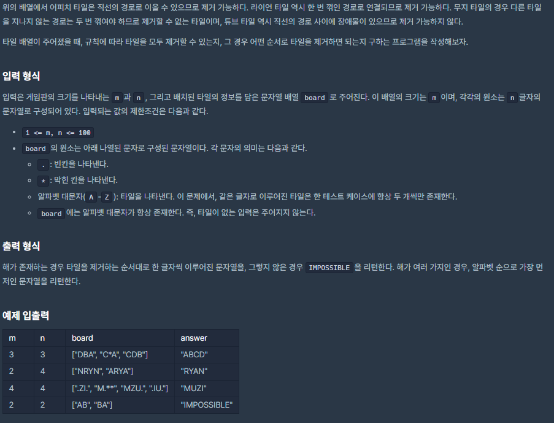

# [[2017 카카오코드 본선] 리틀 프렌즈 사천성](https://programmers.co.kr/learn/courses/30/lessons/1836)



___
## 🤔접근
- 같은 타일끼리 한 개의 커브만 허용하여 이어지는 경우들을 찾고, 이 중 가장 아스키코드 값이 작은 타일을 제거하는 순으로 진행하며, 모든 타일을 제거하거나, 더 이상 타일을 제거할 수 없을 때 까지 반복하면 된다.
- board에서 타일인 경우만 찾아서, 자료구조 Map에 저장하면 정렬된 상태를 유지할 수 있으므로 아스키코드 값이 가장 작은 타일을 먼저 제거할 수 있다.
- 커브는 한 개까지만 허용 되므로, 4방향으로 한 번씩 직선방향으로 이동하면서, 각 이동마다 양 옆으로도 탐색하여 같은 타일을 찾자. 이는 DFS를 이용하자.
___
## 💡풀이
- <B>알고리즘 & 자료구조</B>
    - `DFS`
	- `Map`
- <b>구현</b>
	- 먼저 타일을 key로, 타일의 두 위치를 value로 저장하는 pos를 만들고, board를 탐색하면서 타일인 경우, pos[타일]에 위치를 저장하였다.
    - 모든 타일을 탐색(`pos.empty()`)하거나, 타일을 더 이상 제거할 수 없는 경우(`target == ' '`) 무한 루프를 탈출하는 반복문 안에 구현 코드를 작성하였다.
        - pos에서 순서대로 타일을 꺼내어, 해당 위치에서 DFS 방식으로 4방향으로 쭉 직진 이동하면서, 이동의 양 옆 직선 방향으로도 탐색하였다.
        - 탐색하면서 동일한 타일을 찾은 경우, 바로 반복문을 탈출하여 타일을 제거, answer에 추가하였다.
    - 최종적으로 반복문을 탈출했을 때, pos가 비어 있지 않다면 실패한 경우이므로 IMPOSSIBLE을 반환하였다.
___
## ✍ 피드백
___
## 💻 구현 코드
```c++
#include <string>
#include <vector>
#include <map>

using namespace std;

const int dr[] = {-1, 0, 1, 0};
const int dc[] = {0, 1, 0, -1};

string solution(int m, int n, vector<string> board) {
    string answer = "";

    map<char, vector<pair<int, int>>> pos;
    for (int i = 0; i < m; i++) {
        for (int j = 0; j < n; j++) {
            char tile = board[i][j];
            if (tile != '.' && tile != '*')
                pos[tile].emplace_back(i, j);
        }
    }

    while (!pos.empty()) {
        char target = ' ';
        auto iter = pos.begin();

        while (iter != pos.end()) {
            char tile = (*iter).first;
            int row = (*iter).second[0].first;
            int col = (*iter).second[0].second;
            bool flag = false;

            for (int i = 0; i < 4; i++) {
                int nextRow = row + dr[i];
                int nextCol = col + dc[i];

                if (nextRow < 0 || nextCol < 0 || nextRow >= m || nextCol >= n)
                    continue;
                if (board[nextRow][nextCol] != '.' && board[nextRow][nextCol] != tile)
                    continue;

                if (board[nextRow][nextCol] == tile) {
                    flag = true;
                    break;
                }

                while (true) {
                    if (nextRow < 0 || nextCol < 0 || nextRow >= m || nextCol >= n)
                        break;
                    if (board[nextRow][nextCol] != '.' && board[nextRow][nextCol] != tile)
                        break;

                    int curvedNextRow = nextRow;
                    int curvedNextCol = nextCol;

                    if (dr[i] != 0) {
                        while (!flag) {
                            if (++curvedNextCol >= n)
                                break;
                            if (board[curvedNextRow][curvedNextCol] != '.' && board[curvedNextRow][curvedNextCol] != tile)
                                break;

                            if (board[curvedNextRow][curvedNextCol] == tile) {
                                flag = true;
                                break;
                            }
                        }
                        while (!flag) {
                            if (--curvedNextCol < 0)
                                break;
                            if (board[curvedNextRow][curvedNextCol] != '.' && board[curvedNextRow][curvedNextCol] != tile)
                                break;

                            if (board[curvedNextRow][curvedNextCol] == tile) {
                                flag = true;
                                break;
                            }
                        }
                    }
                    else {
                        while (!flag) {
                            if (++curvedNextRow >= m)
                                break;
                            if (board[curvedNextRow][curvedNextCol] != '.' && board[curvedNextRow][curvedNextCol] != tile)
                                break;

                            if (board[curvedNextRow][curvedNextCol] == tile) {
                                flag = true;
                                break;
                            }
                        }
                        while (!flag) {
                            if (--curvedNextRow < 0)
                                break;
                            if (board[curvedNextRow][nextCol] != '.' && board[curvedNextRow][nextCol] != tile)
                                break;

                            if (board[curvedNextRow][curvedNextCol] == tile) {
                                flag = true;
                                break;
                            }
                        }
                    }

                    if (flag)
                        break;

                    nextRow += dr[i];
                    nextCol += dc[i];
                }

                if (flag)
                    break;
            }

            if (flag) {
                target = tile;
                break;
            }

            ++iter;
        }

        if (target == ' ')
            break;
        
        auto v = pos[target];
        board[v[0].first][v[0].second] = '.';
        board[v[1].first][v[1].second] = '.';
        answer.push_back(target);
        pos.erase(target);
    }

    if (!pos.empty())
        answer = "IMPOSSIBLE";

    return answer;
}
```