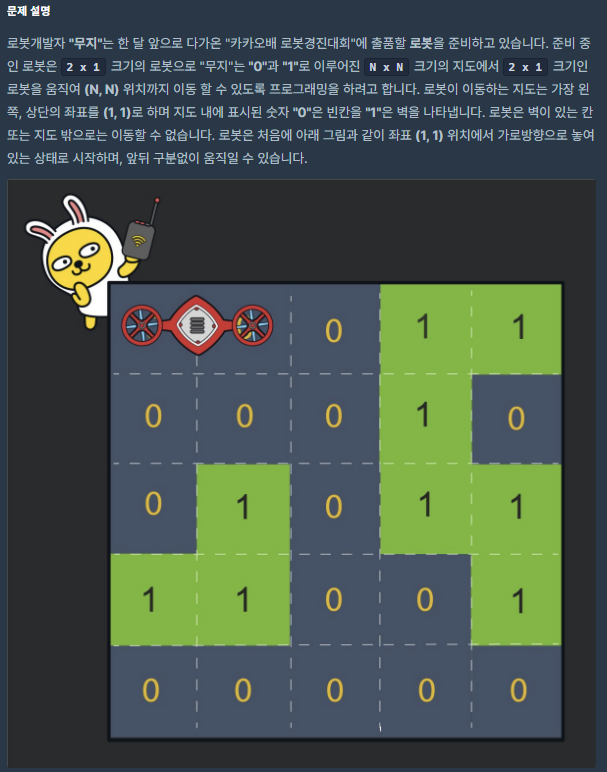

# [[2020 KAKAO BLIND RECRUITMENT] 블록 이동하기](https://programmers.co.kr/learn/courses/30/lessons/60063)




___
## 🤔접근
- 로봇이 도착지점까지 이동할 때 가능한 최소 시간을 구하는 문제이다.
    - 전형적인 길 찾기 문제로, 완전 탐색으로는 시간이 오래 걸리므로, 동적 계획법을 추가로 사용해서 불필요한 탐색을 줄이자.
___
## 💡풀이
- <B>알고리즘 & 자료구조</B>
    - `DFS`
	- `DP`
- <b>구현</b>
    - `dp[머리 위치][꼬리 위치] = 해당 위치까지 이동하는데 걸린 최소 시간`
        - 머리 위치와 꼬리 위치는 각각 (row * N + col)이다.
        - 머리와 꼬리의 위치가 바뀐 경우에도 동일한 위치에 해당함에 주의하자.
	- 로봇이 이동할 수 있는 방법은 아래와 같다.
        - 가로 배치인 경우
            - 이동 : 위, 아래, 왼쪽, 오른쪽
            - 회전 : 머리(위, 아래), 꼬리(위, 아래)
        - 세로 배치인 경우
            - 이동 : 위, 아래, 왼쪽, 오른쪽
            - 회전 : 머리(왼쪽, 오른쪽), 꼬리(왼쪽, 오른쪽)
    - 각 방향으로 이동시키면서 아래의 조건들을 만족하면 이동시킨다.
        - 이동 경로에 벽(1)이 존재하지 않는 경우
        - 이동한 위치가 인덱스 범위를 초과하지 않는 경우
        - 이동한 위치의 dp 값이 현재 시간 + 1 보다 큰 경우
    - 이동하는 경우, DFS으로 해당 위치부터 다시 탐색하며, 해당 위치의 DP 값을 time + 1으로 바꾸어준다.
___
## ✍ 피드백
___
## 💻 구현 코드
```c++
#include <string>
#include <vector>

using namespace std;

#define MAX 1000000000

int N;
int answer = MAX;
vector<vector<int>> board;
vector<vector<int>> dp;

class Position{
public:
    pair<int, int> head;
    pair<int, int> tail;
    
    Position(int row1, int col1, int row2, int col2){
        this->head = make_pair(row1, col1);
        this->tail = make_pair(row2, col2);
    }
};

void DFS(Position pos, int time) {
    if (pos.head == make_pair(N - 1, N - 1) || pos.tail == make_pair(N - 1, N - 1)) {
        answer = min(answer, time);
        return;
    }

    time++;
    int row, col, nextRow, nextCol, fi, se;

    // 같은 [행]에 놓여 있는 경우
    if (pos.head.first == pos.tail.first) {
        // [공통]

        // [위]로 이동
        nextRow = pos.head.first - 1;
        fi = nextRow * N + pos.head.second;
        se = nextRow * N + pos.tail.second;
        if (nextRow >= 0 && time < dp[fi][se]
            && (board[nextRow][pos.head.second] != 1 && board[nextRow][pos.tail.second] != 1)) {
            dp[fi][se] = dp[se][fi] = time;
            DFS(Position(nextRow, pos.head.second, nextRow, pos.tail.second), time);
        }

        // [아래]로 이동
        nextRow = pos.head.first + 1;
        fi = nextRow * N + pos.head.second;
        se = nextRow * N + pos.tail.second;
        if (nextRow < N && time < dp[fi][se]
            && (board[nextRow][pos.head.second] != 1 && board[nextRow][pos.tail.second] != 1)) {
            dp[fi][se] = dp[se][fi] = time;
            DFS(Position(nextRow, pos.head.second, nextRow, pos.tail.second), time);
        }

        // =================================================================================================

        // [머리]를 움직이는 경우
        row = pos.head.first;
        col = pos.head.second;

        // [왼쪽]으로 이동
        nextCol = col - 1;
        fi = row * N + nextCol;
        se = row * N + col;
        if (nextCol >= 0 && time < dp[fi][se] && board[row][nextCol] != 1) {
            dp[fi][se] = dp[se][fi] = time;
            DFS(Position(row, nextCol, row, col), time);
        }
        // [오른쪽]으로 이동
        nextCol = col + 1;
        fi = row * N + nextCol;
        se = row * N + col;
        if (nextCol < N && time < dp[fi][se] && board[row][nextCol] != 1) {
            dp[fi][se] = dp[se][fi] = time;
            DFS(Position(row, nextCol, row, col), time);
        }
        // [아래]로 회전
        nextRow = row + 1;
        nextCol = pos.tail.second;
        fi = nextRow * N + nextCol;
        se = pos.tail.first * N + pos.tail.second;
        if (nextRow < N && time < dp[fi][se] && board[nextRow][nextCol] != 1 && board[nextRow][col] != 1) {
            dp[fi][se] = dp[se][fi] = time;
            DFS(Position(nextRow, nextCol, pos.tail.first, pos.tail.second), time);
        }
        // [위]로 회전
        nextRow = row - 1;
        nextCol = pos.tail.second;
        fi = nextRow * N + nextCol;
        se = pos.tail.first * N + pos.tail.second;
        if (nextRow >= 0 && time < dp[fi][se] && board[nextRow][nextCol] != 1 && board[nextRow][col] != 1) {
            dp[fi][se] = dp[se][fi] = time;
            DFS(Position(nextRow, nextCol, pos.tail.first, pos.tail.second), time);
        }

        // =================================================================================================

        // [꼬리]를 움직이는 경우
        row = pos.tail.first;
        col = pos.tail.second;

        // [왼쪽]으로 이동
        nextCol = col - 1;
        fi = row * N + nextCol;
        se = row * N + col;
        if (nextCol >= 0 && time < dp[fi][se] && board[row][nextCol] != 1) {
            dp[fi][se] = dp[se][fi] = time;
            DFS(Position(row, nextCol, row, col), time);
        }
        // [오른쪽]으로 이동
        nextCol = col + 1;
        fi = row * N + nextCol;
        se = row * N + col;
        if (nextCol < N && time < dp[fi][se] && board[row][nextCol] != 1) {
            dp[fi][se] = dp[se][fi] = time;
            DFS(Position(row, nextCol, row, col), time);
        }
        // [아래]로 회전
        nextRow = row + 1;
        nextCol = pos.head.second;
        fi = nextRow * N + nextCol;
        se = pos.head.first * N + pos.head.second;
        if (nextRow < N && time < dp[fi][se] && board[nextRow][nextCol] != 1 && board[nextRow][col] != 1) {
            dp[fi][se] = dp[se][fi] = time;
            DFS(Position(nextRow, nextCol, pos.head.first, pos.head.second), time);
        }
        // [위]로 회전
        nextRow = row - 1;
        nextCol = pos.head.second;
        fi = nextRow * N + nextCol;
        se = pos.tail.first * N + pos.tail.second;
        if (nextRow >= 0 && time < dp[fi][se] && board[nextRow][nextCol] != 1 && board[nextRow][col] != 1) {
            dp[fi][se] = dp[se][fi] = time;
            DFS(Position(nextRow, nextCol, pos.head.first, pos.head.second), time);
        }
    }
    // 같은 [열]에 놓여 있는 경우
    else {
        // [공통]

        // [오른쪽]으로 이동
        nextCol = pos.head.second + 1;
        fi = pos.head.first * N + nextCol;
        se = pos.tail.first * N + nextCol;
        if (nextCol < N && time < dp[fi][se]
            && (board[pos.head.first][nextCol] != 1 && board[pos.tail.first][nextCol] != 1)) {
            dp[fi][se] = dp[se][fi] = time;
            DFS(Position(pos.head.first, nextCol, pos.tail.first, nextCol), time);
        }

        // [왼쪽]으로 이동
        nextCol = pos.head.second - 1;
        fi = pos.head.first * N + nextCol;
        se = pos.tail.first * N + nextCol;
        if (nextCol >= 0 && time < dp[fi][se]
            && (board[pos.head.first][nextCol] != 1 && board[pos.tail.first][nextCol] != 1)) {
            dp[fi][se] = dp[se][fi] = time;
            DFS(Position(pos.head.first, nextCol, pos.tail.first, nextCol), time);
        }

        // =================================================================================================

        // [머리]를 움직이는 경우
        row = pos.head.first;
        col = pos.head.second;

        // [왼쪽]으로 회전
        nextRow = pos.tail.first;
        nextCol = col - 1;
        fi = nextRow * N + nextCol;
        se = pos.tail.first * N + pos.tail.second;
        if (nextCol >= 0 && time < dp[fi][se] && board[row][nextCol] != 1 && board[nextRow][nextCol] != 1) {
            dp[fi][se] = dp[se][fi] = time;
            DFS(Position(nextRow, nextCol, pos.tail.first, pos.tail.second), time);
        }
        // [오른쪽]으로 회전
        nextRow = pos.tail.first;
        nextCol = col + 1;
        fi = nextRow * N + nextCol;
        se = pos.tail.first * N + pos.tail.second;
        if (nextCol < N && time < dp[fi][se] && board[row][nextCol] != 1 && board[nextRow][nextCol] != 1) {
            dp[fi][se] = dp[se][fi] = time;
            DFS(Position(nextRow, nextCol, pos.tail.first, pos.tail.second), time);
        }
        // [아래]로 이동
        nextRow = row + 1;
        fi = nextRow * N + col;
        se = row * N + col;
        if (nextRow < N && time < dp[fi][se] && board[nextRow][col] != 1) {
            dp[fi][se] = dp[se][fi] = time;
            DFS(Position(nextRow, col, row, col), time);
        }
        // [위]로 이동
        nextRow = row - 1;
        fi = nextRow * N + col;
        se = row * N + col;
        if (nextRow >= 0 && time < dp[fi][se] && board[nextRow][col] != 1) {
            dp[fi][se] = dp[se][fi] = time;
            DFS(Position(nextRow, col, row, col), time);
        }

        //=================================================

        // [꼬리]를 움직이는 경우
        row = pos.tail.first;
        col = pos.tail.second;

        // [왼쪽]으로 회전
        nextRow = pos.head.first;
        nextCol = col - 1;
        fi = nextRow * N + nextCol;
        se = pos.head.first * N + pos.head.second;
        if (nextCol >= 0 && time < dp[fi][se] && board[row][nextCol] != 1 && board[nextRow][nextCol] != 1) {
            dp[fi][se] = dp[se][fi] = time;
            DFS(Position(nextRow, nextCol, pos.head.first, pos.head.second), time);
        }
        // [오른쪽]으로 회전
        nextRow = pos.head.first;
        nextCol = col + 1;
        fi = nextRow * N + nextCol;
        se = pos.head.first * N + pos.head.second;
        if (nextCol < N && time < dp[fi][se] && board[row][nextCol] != 1 && board[nextRow][nextCol] != 1) {
            dp[fi][se] = dp[se][fi] = time;
            DFS(Position(nextRow, nextCol, pos.head.first, pos.head.second), time);
        }
        // [아래]로 이동
        nextRow = row + 1;
        fi = nextRow * N + col;
        se = row * N + col;
        if (nextRow < N && time < dp[fi][se] && board[nextRow][col] != 1) {
            dp[fi][se] = dp[se][fi] = time;
            DFS(Position(nextRow, col, row, col), time);
        }
        // [위]로 이동
        nextRow = row - 1;
        fi = nextRow * N + col;
        se = row * N + col;
        if (nextRow >= 0 && time < dp[fi][se] && board[nextRow][col] != 1) {
            dp[fi][se] = dp[se][fi] = time;
            DFS(Position(nextRow, col, row, col), time);
        }
    }
}

int solution(vector<vector<int>> b) {
    board = b;
    N = b.size();
    dp.assign(N * N, vector<int>(N * N, MAX));

    dp[0][1] = dp[1][0] = 1;
    DFS(Position(0, 0, 0, 1), 0);

    return answer;
}
```