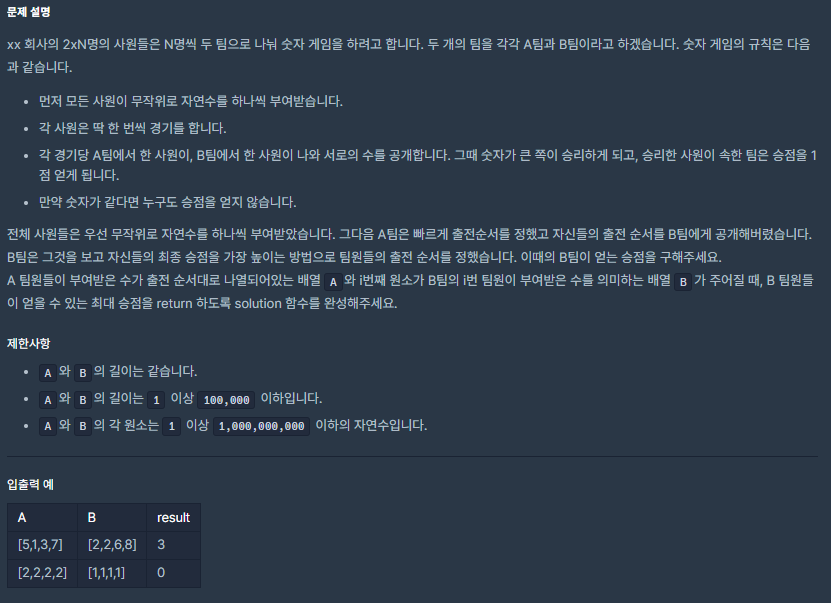
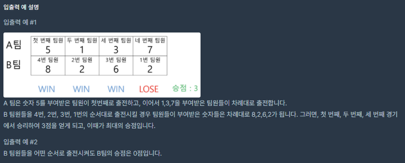

# [[Summer/Winter Coding(~2018)] 숫자 게임](https://programmers.co.kr/learn/courses/30/lessons/12987#)



___
## 🤔접근
___
## 💡풀이
- <b>알고리즘 & 자료구조</b>
    - `Greedy`
- <b>구현</b>
    - A와 B를 모두 오름차순으로 정렬한 후, A를 큰 숫자부터 거꾸로 탐색하면서 아래의 작업을 하였다.
        - B를 큰 숫자부터 거꾸로 탐색하면서, B의 숫자가 A의 숫자보다 큰 경우 승점을 올리고, A와 B 모두 다음 큰 수로 이동하였다. 
            - 만약, A[i] ≥ B[idx]라면, B가 승점을 얻지 못하므로, A만 다음 큰 수로 이동하였다.
    - 시간 복잡도: `O(N)`
___
## ✍ 피드백
___
## 💻 구현 코드
```c++
#include <string>
#include <vector>
#include <algorithm>

using namespace std;

int solution(vector<int> A, vector<int> B) {
    int answer = 0;
    
    sort(A.begin(), A.end());
    sort(B.begin(), B.end());
    
    for(int i = A.size() - 1, idx = B.size() - 1; i >= 0; i--) {
        if(A[i] < B[idx]) {
            answer++;
            idx--;
        }
    }
    
    return answer;
}
```