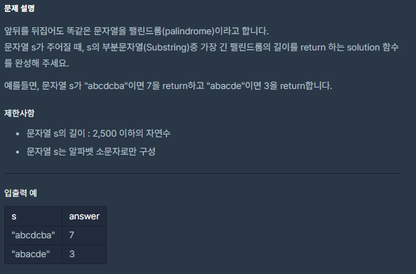

# [가장 긴 팰린드롬](https://programmers.co.kr/learn/courses/30/lessons/12904)


___
## 🤔접근
___
## 💡풀이
- <B>알고리즘 & 자료구조</B>
    - `Manacher`
___
## ✍ 피드백
___
## 💻 구현 코드
```c++
#include <iostream>
#include <string>
#include <algorithm>
#include <vector>

using namespace std;

int manachers(const string& S) {
    int N = S.size();
    int r = 0, p = 0;
    vector<int> A(N);

    for (int i = 0; i < N; i++) {
        if (i <= r)
            A[i] = min(A[2 * p - i], r - i);
        else
            A[i] = 0;

        while (i - A[i] - 1 >= 0 && i + A[i] + 1 < N && S[i - A[i] - 1] == S[i + A[i] + 1])
            A[i]++;

        if (r < i + A[i]) {
            r = i + A[i];
            p = i;
        }
    }

    return *max_element(A.begin(), A.end());
}

int solution(string s) {
    string str = "";
    int len = s.size();
    
    for(int i = 0; i < len; i++) {
        str += '#';
        str += s[i];
    }
    str += '#';
    
    return manachers(str);
    
}
```