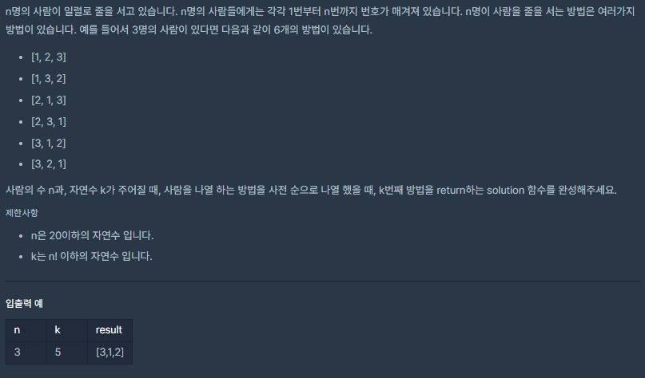

# [줄 서는 방법](https://programmers.co.kr/learn/courses/30/lessons/12936)


___
## 🤔접근
___
## 💡풀이
- <b>구현</b>
    - 각 열마다 [n!, (n - 1)!, ..., 1!]의 배치할 수 있는 경우의 수가 존재한다.
        - 따라서, `ceil(k / (n - 1)!)`번째 숫자가 각 열의 숫자에 해당한다.
            - 해당 숫자를 answer 배열의 뒤에 추가해준다.
        - 다음 열을 구하기 위해, k에서 `(ceil(k / (n - 1)!) - 1) * (n - 1)!`을 빼주고, n에서 1을 빼준다.
        - 위를 n이 0이 될 때까지 반복하면 k번째의 배치를 구할 수 있다.
___
## ✍ 피드백
___
## 💻 구현 코드
```c++
#include <string>
#include <vector>
#include <math.h>

using namespace std;

vector<int> solution(int n, long long k) {
    vector<int> answer;

    vector<long long> fact(20 + 1);
    fact[0] = 1;
    for (int i = 1; i <= 20; i++)
        fact[i] = fact[i - 1] * i;

    vector<bool> isUsed(21);

    while (n) {
        int num = ceil((double)k / fact[n - 1]);
        int cnt = 0;
        for (int i = 1; i <= 20; i++) {
            if (!isUsed[i]) {
                if (++cnt == num) {
                    isUsed[i] = true;
                    answer.push_back(i);
                    break;
                }
            }
        }

        k -= (num - 1) * fact[n - 1];
        n--;
    }

    return answer;
}
```