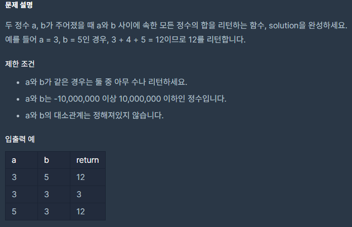

## [[SQL] 두 정수 사이의 합](https://programmers.co.kr/learn/courses/30/lessons/12912?language=cpp)
<br>
<br>
___

## 💡 풀이
> **등차수열의 합**<br>
> 등차수열의 제 n항부터 제 m항까지의 합을 S, 제 n항이 a, 제 m항이 b 일 때 수식은 다음과 같다.<br>
> `S = (∣a − b∣ + 1) ∗ (a + b) / 2`
___
```c++
#include <string>
#include <vector>

using namespace std;

long long solution(int a, int b) {
    return (long long)(a + b) * (abs(a - b) + 1) / 2;
}
```

