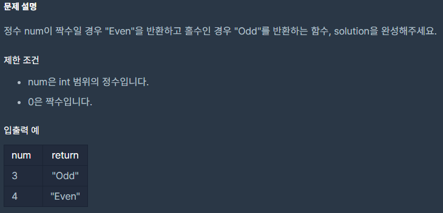

## [[Lv. 1] 짝수와 홀수](https://programmers.co.kr/learn/courses/30/lessons/12937)
<br>
<br>
주어진 문제는 "정수 num"의 짝수 or 홀수 판별이다.<br>
정수는 음의 정수, 0, 그리고 양의 정수로 나뉘므로 판별할 때 매개변수로 넘겨온 값에 반드시 절댓값을 취해야 한다.
```c
#include <stdio.h>
#include <stdbool.h>
#include <stdlib.h>
#include <math.h>

char* solution(int num) {
    char* answer = (char *)malloc(sizeof(char) * 4);

    if(abs(num) % 2 == 1) answer = "Odd";
    else answer = "Even";
    
   
    return answer;
}
```

