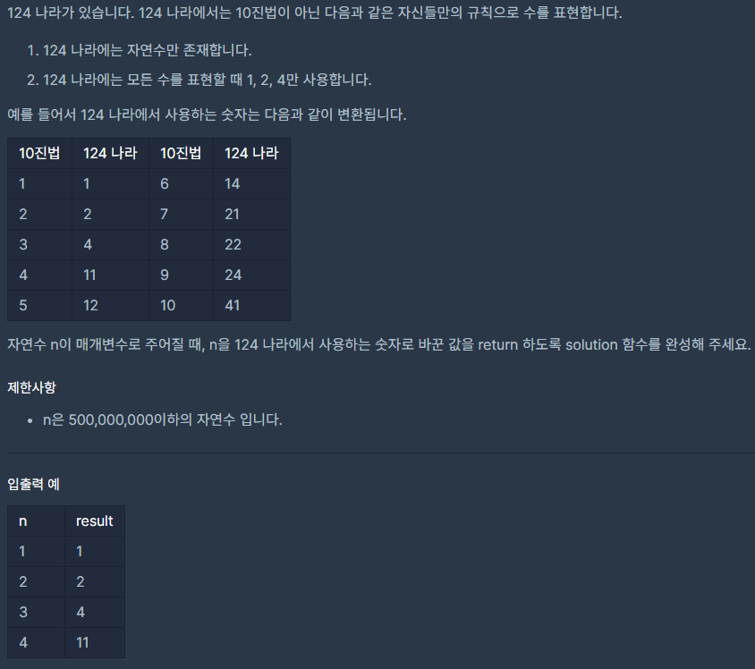

## [[Lv. 2] 124 나라의 숫자](https://programmers.co.kr/learn/courses/30/lessons/12899)
<br>
<br>
___

## 💡 풀이
- 10진법 -> 3진법 전환하는 문제이다.
- 일반적인 진법 변환법과 달리, 0 대신 4를 사용해야하는 조건이 존재한다.
- 생각 나는대로 작성한 코드와 이후에 개선한 코드를 정리하였다.
___
### 생각 나는대로 작성한 코드
```c++
#include <string>
#include <vector>

string solution(int n) {
    string answer = "";

    if (n == 1) 
        return "1";

    int m = 1;
    int max = 0;
   
   // -------------------------------------------------------
   /*
        1부터 n미만의 3의 배수인 m까지 더한 값을 max 변수에 저장
   */
    while (n > m) {
        m *= 3;
        max += m;
    }
    max -= m;
    max++;
    m /= 3;
    // -------------------------------------------------------

    /*
        n의 제잎 높은 자릿수부터 124 나라의 진법으로 변환.
        
        m에 3부터 1까지 곱해보면서 각각의 곱한 값을 n에서 뺐을 때, 
        max - m이상이면 n값을 갱신하고 answer에 문자열을 추가한다.

        이유는 124 나라의 진법에는 0이 존재하지 않기 때문이다.

        124나라의 진법은 맨 오른쪽 자리수부터 왼쪽 자리수로 가면서
        1, 2, 3/3, 6, 9/9, 18, 27/27, 54, 81/ ... 순서로 각각 [1, 2, 4]로 표현이 가능하다.

        예를들어 6을 124 나라의 진법으로 변환할 때,
        오른쪽에서 (3, 6, 9) 자리수에서 바로 6을 2로 바꿔 표현해버리면, (1, 2, 3) 자리수는 0으로 표현해야 하는데, 
        124 나라의 진법에는 0이 존재하지 않기 때문에 불가능하다. 
        그러므로, (3, 6, 9) 자리수는 3을 1로 바꿔 표현하고, (1, 2, 3) 자리수에서 3을 4로 바꿔 표현해야 한다.

        요약하자면, 1~3 / 3~9 / ... ~ n 까지 반드시 각각 한 번 씩 1, 2, 4중 하나를 표현해주어야 한다.

    */
    while (m > 0) {
        if (n - 3 * m >= max - m) {
            n -= 3 * m;
            answer += '4';
        }
        else if (n - 2 * m >= max - m) {
            n -= 2 * m;
            answer += '2';
        }
        else if (n - m >= max - m) {
            n -= m;
            answer += '1';
        }

        max -= m;
        m /= 3;
    }

    return answer;
}
```
___
### 개선한 코드
```c++
#include <string>
#include <vector>
#include <algorithm>

using namespace std;

string solution(int n) {
    string answer = "";
    char num[] = {'4', '1', '2'};
    
    /*
        1~3 자리수부터 n까지 올라가면서 진법 변환을 한다.

        n을 3으로 나눈 나머지가 0이면 answer에 4를 추가하고, n을 3으로 나눈 뒤 1을 빼준다.
        나머지가 1이나 2라면 answer에 각각 1, 2를 추가하고, n을 3으로 나누어준다.

        나머지가 0인 경우에 n을 3으로 나누고 "1을 빼주는" 이유는 다음과 같다.
        1, 2, 3/4, 5, 6/7, 8, 9/ ... 이런 식으로 3의 배수를 기준으로 나뉘는데
        3의 몫은 1이라서 그냥 나눠서 몫을 구하면 12/345/678/9 으로 구분되기 때문이다.
    */
    while(n){
        answer += (num[n % 3]);
        n % 3 == 0 ? n = n / 3 - 1 : n /= 3;
    }

    reverse(answer.begin(), answer.end());
    
    return answer;
}
```

