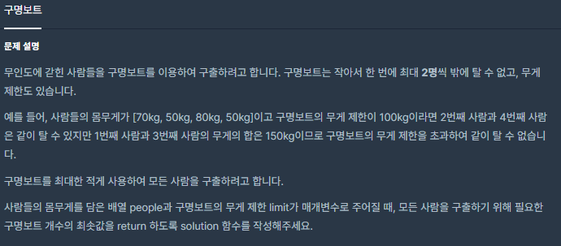
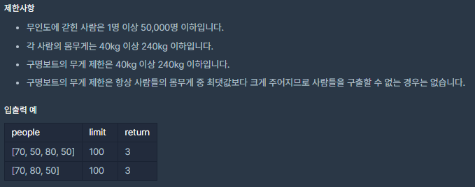

# [[Lv. 2] 구명보트](https://programmers.co.kr/learn/courses/30/lessons/42885)



___
## 🤔접근
___
## 💡풀이
- <b>탐욕법(Greedy)</b>을(를) 이용하였다.
	1. 사람들의 몸무게를 내림차순으로 정렬한다.
	2. 몸무게가 가장 많이 나가는 사람과 가장 적게 나가는 사람의 몸무게 합을 구한다.
		- 몸무게 합이 limit 이하라면, 2명을 보트에 태운다.
		- 몸무게 합이 limit 초과라면, 몸무게가 가장 많이 나가는 사람만 보트에 태운다.
	3. 모든 사람이 보트를 타고 탈출할 때 까지 위 과정을 반복한다.
___
## ✍ 피드백
___
## 💻 핵심 코드
```c++
int solution(vector<int> people, int limit) {
    int answer = 0;
        
    sort(people.begin(), people.end(), greater<int>());
    
    int s = 0, e = people.size() - 1;
    while(s <= e){
        if (people.at(s) + people.at(e) <= limit) 
            e--;
        
        s++;
        answer++;
    }
    
    return answer;
}
```