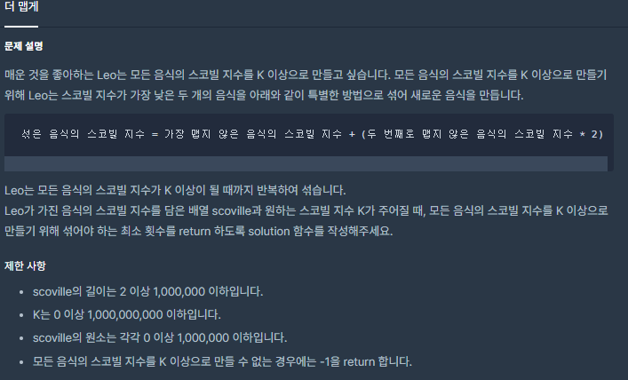
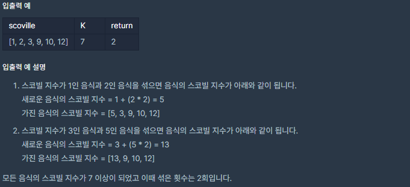

# [[Lv. 2] 더 맵게](https://programmers.co.kr/learn/courses/30/lessons/42626)



___
## 🤔접근
1. <b>가장 맵지 않은 음식의 스코빌 지수를 여러 번 알아내야 한다.</b>
	- 각 스코빌 지수에 우선순위를 매기어 우선순위 큐에 저장하면 O(1)에 해당 지수를 알아낼 수 있다.
___
## 💡풀이
- <b>우선순위 큐 자료구조</b>을(를) 사용하였다.
	- 스코빌 지수가 낮은 음식에 가장 높은 우선순위를 부여한다.
	- 우선순위 큐에서 두 번 pop하여, 두 지수를 더한 결과를 다시 push하고, 섞은 횟수를 카운팅한다.
	- top의 지수가 K 이상이 되면, 섞은 횟수를 반환한다.
	- 모든 음식의 스코빌 지수를 K 이상으로 만들 수 없는 경우는 다음과 같다.
		- 섞은 스코빌 지수가 0
		- 남아 있는 음식이 1개
___
## ✍ 피드백
___
## 💻 핵심 코드
```c++
int solution(vector<int> scoville, int K) {
    int answer = 0;

    priority_queue<int, vector<int>, greater<int>> pq;
    for (int s : scoville)
        pq.push(s);

    while (pq.top() < K) {
        if (pq.size() == 1)
            return -1;

        int first = pq.top();
        pq.pop();
        int second = pq.top();
        pq.pop();

        int newScov = first + 2 * second;
        if (newScov == 0)
            return -1;

        pq.push(newScov);
        answer++;
    }

    return answer;
}
```