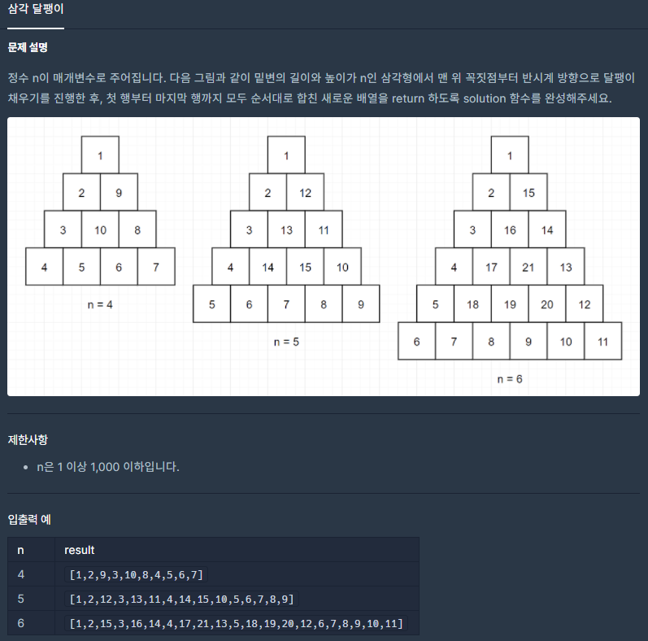

## [[Lv. 2] 삼각 달팽이](https://programmers.co.kr/learn/courses/30/lessons/68645)

___

## 💡 풀이
- 삼각 달팽이 형태로 그려보면, 다음과 같은 규칙성을 발견할 수 있다.
    > n -> n-1 -> n-2 -> ... -> 1
- 삼각 달팽이를 그리는 방향은 세 가지가 존재한다.
    1. row를 한 칸씩 증가시키는 방향
    2. col을 한 칸씩 증가시키는 방향
    3. row와 col을 한 칸씩 감소시키는 방향
- 세 가지 방향 순서대로 n 만큼 이동하면서 숫자를 채우고, 방향이 바뀔 때 마다 주어진 n을 1 감소시킨다.
- n이 0이 되는 순간, 더 이상 숫자를 채울 수 없으므로 반복문을 탈출한다. 
___
## ✍ 피드백
- 삼각 달팽이를 그리지 않고, 수열의 규칙성을 찾으려다 시간을 많이 낭비 함.
- 제한사항에서 n의 크기가 그리 크지 않으므로, 삼각 달팽이를 직접 그려봐야 O(n)이다.
    - 시간 복잡도가 그리 크지 않은 경우에는, 주어진 형태를 직접 그리는 규칙성을 파악하여 빠르게 해결하자.
___
```c++
#include <string>
#include <vector>

using namespace std;

vector<int> solution(int n) {
    vector<int> answer;
    vector<vector<int>> v;
    
    // base condition
    v.resize(n);
    for (int i = 0; i < n; i++)
        v[i].resize(i + 1);
    int p = 1;
    int r = -1, c = 0;
    
    // make triangular-snail
    while (true) {
        // move down
        for (int i = 0; i < n; i++) 
            v[++r][c] = p++;
        if (--n == 0)
            break;

        // move right
        for (int i = 0; i < n; i++) 
            v[r][++c] = p++;
        if (--n == 0)
            break;

        // move up
        for (int i = 0; i < n; i++) 
            v[--r][--c] = p++;
        if (--n == 0)
            break;
    }

    // finish
    for (int i = 0; i < v.size(); i++)
        for (int n : v[i])
            answer.push_back(n);

    return answer;
}
```