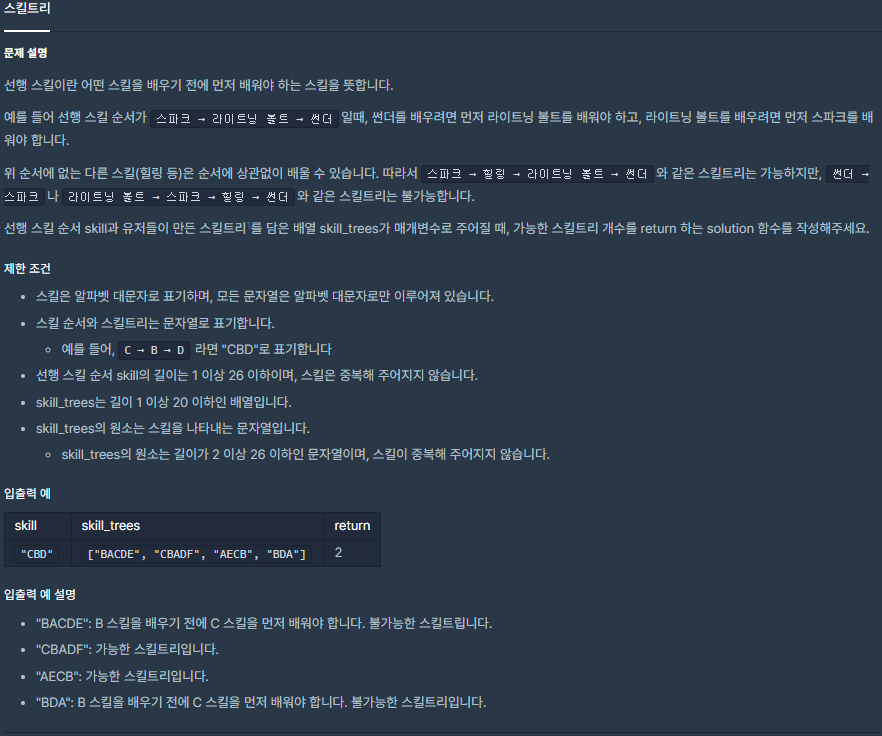

## [[Lv. 2] 스킬트리](https://programmers.co.kr/learn/courses/30/lessons/49993)

___

## 💡 풀이
- 주어진 skill_trees에서 각각 스킬트리의 스킬을 차례대로 탐색하면서, 다음의 두 가지 작업을 해야 한다.
    1. 해당 스킬이 선행 스킬에 속하는지 판별
        - 탐색 연산이 O(1)인 `unordered_map`에 선행 스킬을 저장함으로써 탐색 연산 최적화
    2. 선행 스킬이라면, 순서에 맞게 배우는 것인지 판별
        - 인덱스 변수를 이용하여 순서 판별 - O(1)
___
## ✍ 피드백
___
```c++
#include <string>
#include <vector>
#include <unordered_map>

using namespace std;

int solution(string skill, vector<string> skill_trees) {
    int answer = 0;
    unordered_map<char, int> m;
    
    int idx = 0;
    for(auto& s : skill)
        m.emplace(s, idx++);
    
    for(auto& skill_tree : skill_trees){
        bool flag = true;
        idx = 0;
        
        for(auto& sk : skill_tree){
            if(m.find(sk) != m.end()){
                if(m[sk] != idx++){
                    flag = false;
                    break;
                }
            }       
        }
        
        if(flag)
            answer++;
    }
    
    return answer;
}
```