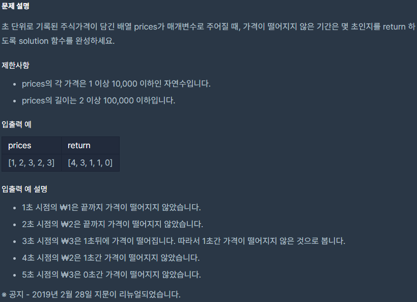

## [[Lv. 2] 주식가격](https://programmers.co.kr/learn/courses/30/lessons/42584)

___

## 💡 풀이
- 모든 경우의 수를 확인하면서 푸는 것은 O(n!)이 걸리므로, 다른 방법을 사용해야 한다.
- 제일 먼저 떠오른 것은 `stack`을 이용하는 것이었다.
    - prices 배열을 1st index부터 차례대로 방문하면서 stack에 현재 index와 price를 push한다.
    - 만약, stack의 top에 존재하는 price보다 현재 price가 작은 경우는 아래와 같이 처리한다.
        - `stack의 top에 저장되어 있는 index`를 `answer배열의 index`로 사용한다.
        - answer배열의 해당 index에 `현재 index - stack의 top에 저장되어 있는 index`를 저장한다.
    - 방문처리를 모두 마친 후, stack이 비어있지 않은 경우 아래와 같이 처리한다.
        - `stack의 top에 저장되어 있는 index`를 `answer배열의 index`로 사용한다.
        - answer배열의 해당 index에 `prices배열의 마지막 index - stack의 top에 저장되어 있는 index`를 저장한다. 
___
```c++
#include <string>
#include <vector>
#include <stack>

using namespace std;

vector<int> solution(vector<int> prices) {
    vector<int> answer(prices.size());
    stack<pair<int, int>> s;
    s.push(make_pair(0, prices[0]));
    for (int i = 1; i < prices.size(); i++) {
        while(!s.empty() && prices[i] < s.top().second) {
            answer[s.top().first] = i - s.top().first;
            s.pop();
        }
        s.push(make_pair(i, prices[i]));
    }

    while (!s.empty()) {
        answer[s.top().first] = prices.size() - s.top().first - 1;
        s.pop();
    }

    return answer;
}
```