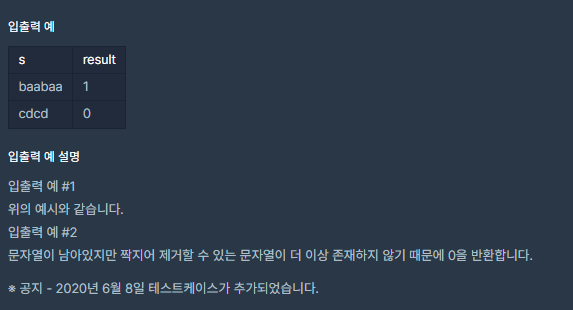

# [[Lv. 2] 짝지어 제거하기](https://programmers.co.kr/learn/courses/30/lessons/12973)



___
## 🤔접근
1. <b>문자열의 첫 번째 문자부터 탐색하면서 인접한 문자가 동일하면, 제거하는 문제이다.</b>
	- 문자를 스택에 차례대로 넣으면서 두 문자씩 탐색하는 방식으로 해결하자.
	- 시간 복잡도: `O(N)`
___
## 💡풀이
- <B>스택(Stack) 자료구조</B>을(를) 사용하였다.
	- 문자열을 첫 번째 인덱스부터 차례대로 탐색한다.
		- 스택의 top에 있는 문자와 현재 인덱스의 문자가 같으면, pop하고 다음 문자를 탐색한다.
		- 그렇지 않다면, 현재 인덱스의 문자를 push한다.
	- 모든 문자 탐색이 끝나고, 스택이 비어 있으면 성공, 그렇지 않으면 실패이다.
___
## ✍ 피드백
___
## 💻 핵심 코드
```c++
#include <iostream>
#include <string>
#include <stack>

using namespace std;

int solution(string str) {
    stack<char> s;
    for (int i = 0; i < str.size(); i++) {
        if (!s.empty()) {
            if (s.top() == str[i]) {
                s.pop();
                continue;
            }
        }
        s.push(str[i]);
    }

    if (!s.empty())
        return 0;
    return 1;
}
```