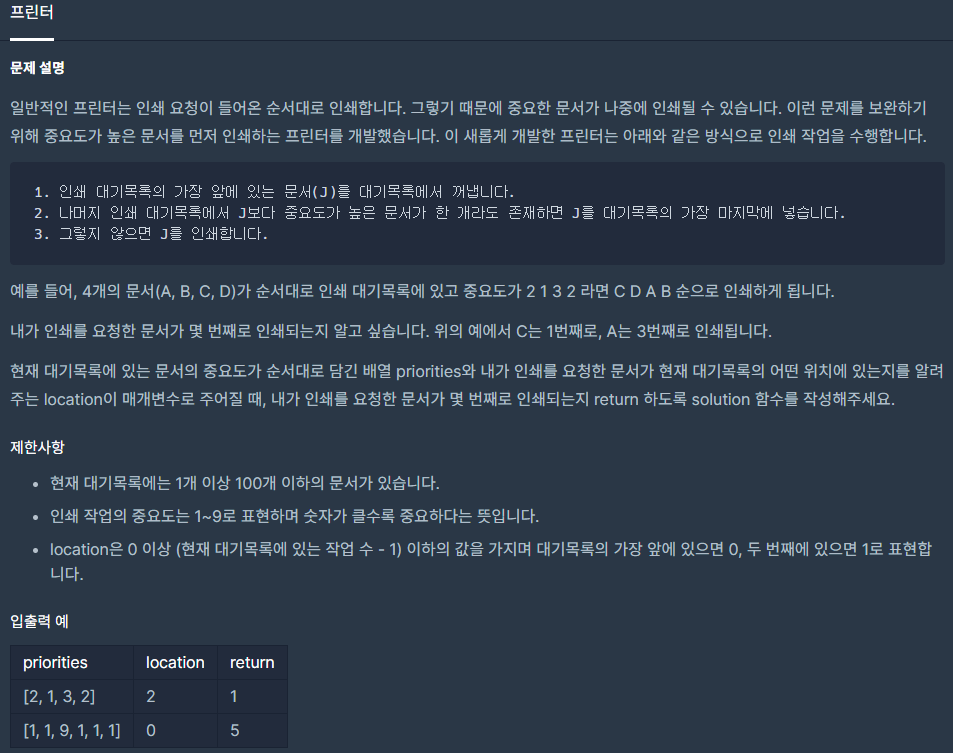

## [[Lv. 2] 프린터](https://programmers.co.kr/learn/courses/30/lessons/42587)

___

## 💡 풀이
- 자료구조 큐를 이용하여 해결하였다.
- 아이디어는 다음과 같다.
    - 우선순위 1~9 각각 몇 개의 인쇄목록이 존재하는지에 대한 정보를 담고있는 배열 n을 선언
    - 입력으로 받은 인쇄 대기열을 순서대로 큐에 저장하되, 인덱스 정보와 함께 저장한다
        > pair(index, priority)
    - 입력을 받으면서 대기열에 존재하는 가장 우선순위가 높은 값을 max 변수에 담는다
    - 다음으로 무한루프에서 큐의 원소를 하나씩 빼면서, 우선순위를 검사한다.
        - 현재 우선순위가 max보다 작다면, 큐의 끝에 다시 push
        - 현재 우선순위가 max라면,
            - 현재 문서가 내가 인쇄하려는 문서인 경우, 반복문을 탈출한다.
            - 그렇지 않은 경우 현재 문서를 인쇄하고, 몇 번째로 인쇄하는지에 대한 정보를 담고 있는 answer변수를 1 증가시킨다.
                - n[max] 값을 1 감소시키고, 만약 해당 인덱스의 값이 0이 되면, max 값을 갱신시킨다.
___
```c++
#include <string>
#include <vector>
#include <queue>

using namespace std;

int solution(vector<int> priorities, int location) {
    int answer = 1;
    // 우선순위 1~9 각각 몇 개의 인쇄목록이 존재하는지에 대한 정보를 담고있는 배열
    int n[10] = {0};
    int max = 1;
    queue<pair<int, int>> q;
    pair<int, int> find;
    
    int idx = 0;
    for(int p : priorities){
        n[p]++;
        // 입력으로 받은 인쇄 대기열을 순서대로 큐에 저장하되, 인덱스 정보와 함께 저장
        q.push(make_pair(idx, p));
        // 내가 인쇄하려는 문서를 find 변수에 저장 
        if(idx == location)
            find = q.back();
        // 입력을 받으면서 대기열에 존재하는 가장 우선순위가 높은 값을 max 변수에 담는다
        if(max < p)
            max = p;
        idx++;
    }
    
    while(true){
        // 큐의 원소를 하나씩 빼면서, 우선순위를 검사
        pair<int, int> cur = q.front(); q.pop();
            
        if(cur.second < max)
            q.push(cur);  
        else{
            if(cur == find)
                break; 
            // 현재 문서 인쇄 -> 몇 번째 인쇄물인지에 대한 정보를 담고있는 answer변수 갱신
            answer++;
            n[max]--;
            // max 갱신
            while(max > 1 && n[max] == 0){
                max--;
            }
        }
    }      
    
    return answer;
}
```