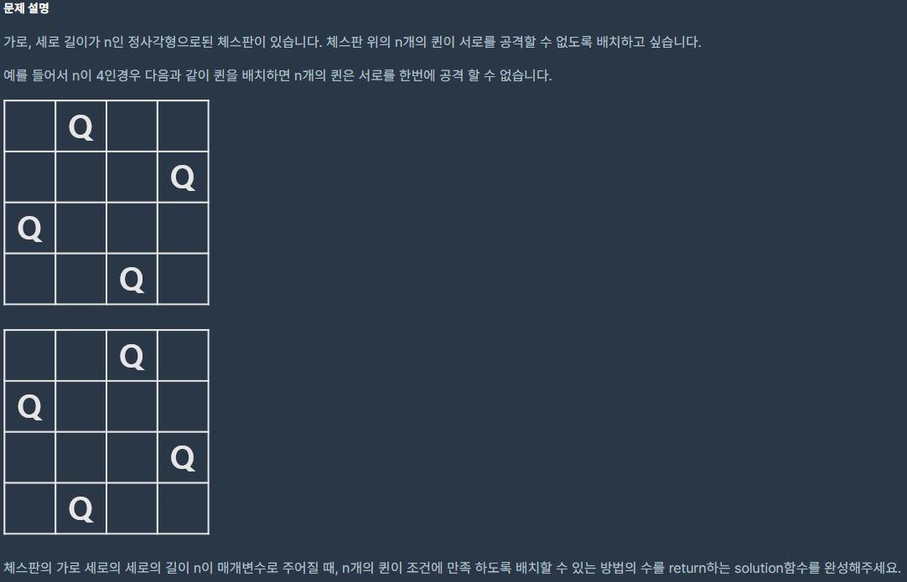
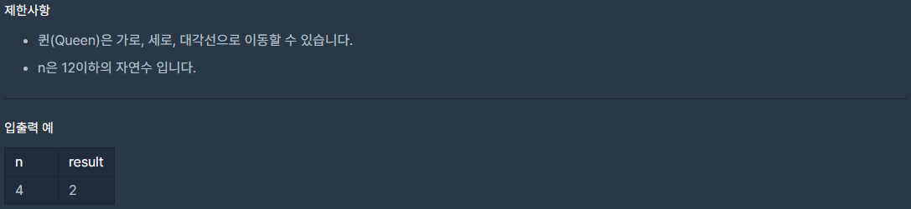

## [[Lv. 3] N-Queen](https://programmers.co.kr/learn/courses/30/lessons/12952)
<br>
<br>
___

## 풀이
모든 경우의 수를 확인해야 한다.<br>
완전탐색으로는 매우 많은 시간이 걸리므로, `제한사항을 보고 불필요한 탐색 횟수를 줄이는 것이 관건`이다.<br>
`퀸(Queen)의 제약사항으로는 가로, 세로, 대각선으로 이동이 가능`하다는 점이 있다.<br>
즉, 0 행부터 각각 열에 퀸을 놓아보면서, 세로와 대각선에 퀸이 존재하는지 확인한 후에 다음 행을 탐색하면 된다.<br>
`재귀함수`를 이용하여 `백트래킹(Back-tracking)` 방식으로 구현하였다. 
___
```c
#include <stdio.h>
#include <stdbool.h>
#include <stdlib.h>
#include <math.h>

int N;
int cnt = 0;
char chess[12];

void N_Queen(int);

int solution(int n) {
    int answer = 0;
    N = n;
    
    N_Queen(0);
    answer = cnt;
    
    return answer;
}

bool check(int n){
    for(int i = 0; i < n; i++){
        if(chess[i] == chess[n])
            return false;
        if(abs(i - n) == abs(chess[i] - chess[n])) 
            return false;
    }
    return true;
}

void N_Queen(int n){
    if(n == N) {
        cnt++;
        return;
    }
        
    bool flag = true;
    for(int i = 0; i < N; i++){
        chess[n] = i;
        if(check(n)) 
            N_Queen(n + 1);      
    }
}
```

