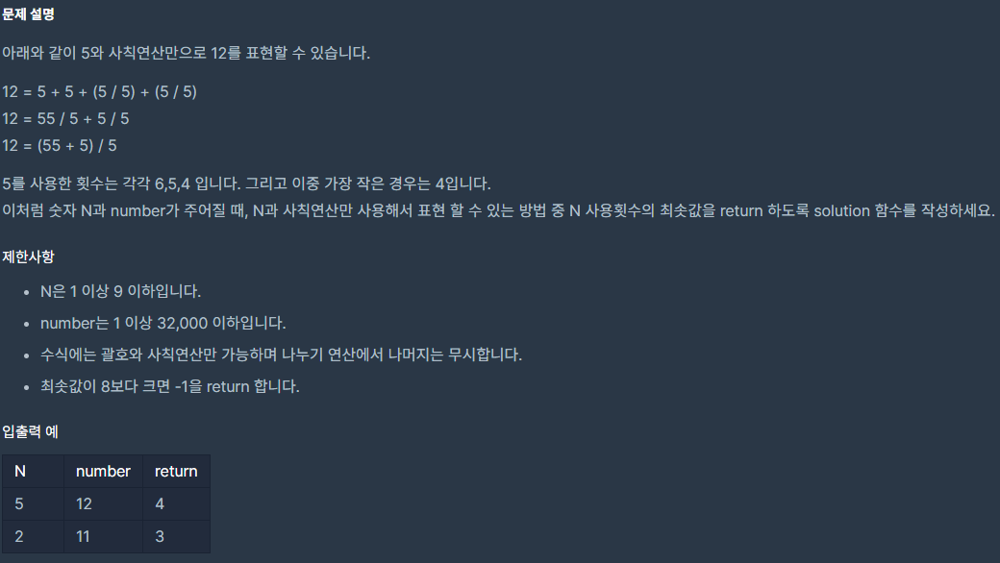

## [[Lv. 3] N으로 표현](https://programmers.co.kr/learn/courses/30/lessons/42895)

___

## 💡 풀이
- 주어진 N을 사용할 수 있는 `최대 횟수는 8회`이다.
- `N을 각각 1회 ~ 8회 사용하여 표현할 수 있는 모든 자연수를 담는 컨테이너`를 만드는 것이 핵심이다.
- 점화식 : dp[n] = {dp[1] + dp[n-1], dp[2] + dp[n-2], ... , dp[m] + dp[m]}
    - `dp`는 집합이다.
    - `+ 연산`은 두 집합의 각 원소들끼리 사칙연산하여 표현할 수 있는 모든 자연수의 집합을 형성하는 것을 의미한다. 
    - `m`은 ceil(n / 2) 혹은 차이가 1인 서로 다른 두 자연수이다.
- dp배열은 중복 값을 허용하지 않으며, 정렬되지 않은 자료구조인 `unordered_set` 형으로 생성하였다.
    - 이 문제에서는 set보다 2배 가량 빠른 속도를 나타낸다.
___
```c++
#include <string>
#include <vector>
#include <unordered_set>

using namespace std;

int solution(int N, int number) {
    if(N == number)
        return 1;
    
    // 중복 값을 허용하지 않고, entry가 key뿐인 STL set을 사용하자.
    // 이 문제에서는 컨테이너가 정렬상태를 유지할 필요가 없으므로 보다 값싼 자료구조인 unordered_set을 사용하자.
    // 숫자 N을 1번부터 8번까지 사용하여 표현할 수 있는 값들을 memoization 하자.
    // 먼저 dp[1] ~ dp[8]에 각각 N, NN, ... NNNNNNNN을 넣어 초기화하자.
    unordered_set<int> dp[9];
    int tmp = N;
    
    for(int i=1; i<=8; i++){
        dp[i].insert(tmp);
        tmp *= 10;
        tmp += N;
    }
    
    // 아래와 같은 순서로 구현하자.
    // dp[2] = dp[1]과 dp[1]을 이용하여 표현할 수 있는 모든 값들 push
    // dp[3] = dp[1]과 dp[2]를 이용하여 표현할 수 있는 모든 값들 push
    // dp[4] = (dp[1], dp[3]), (dp[2], dp[2]) push
    // ...
    
    for(int i=2; i<=8; i++){
        for(int j=1, k = i-1; j <= k; j++, k--){
            for(const int& l : dp[j]){
                for(const int& r : dp[k]){         
                    dp[i].insert(l + r);
                    dp[i].insert(l * r);
                    if(l > r)
                        dp[i].insert(l - r);
                    else if(l < r)
                        dp[i].insert(r - l);
                    if(l >= r && r != 0)
                        dp[i].insert(l / r);
                    else if(r >= l && l != 0)
                        dp[i].insert(r / l);
                }
            }
        }
        
        if (dp[i].find(number) != dp[i].end()) 
		    return i;    
    }
      
    return -1;
}
```