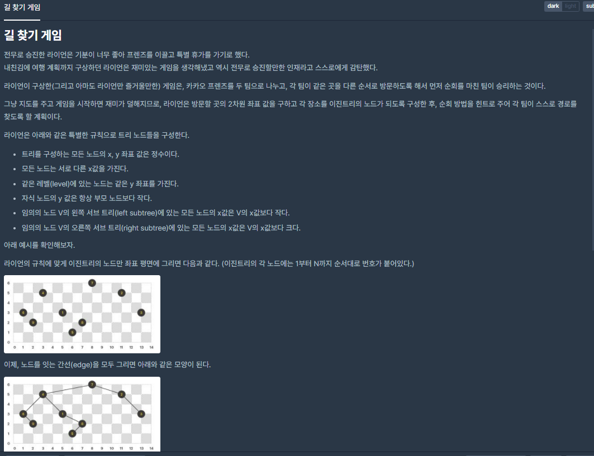
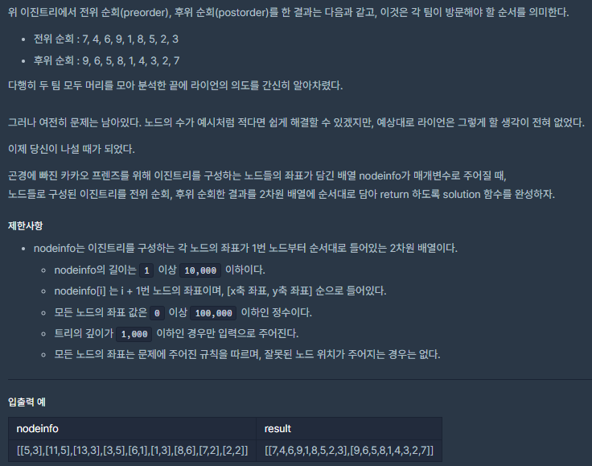

# [[Lv. 3] 길 찾기 게임](https://programmers.co.kr/learn/courses/30/lessons/42892)



___
## 🤔접근
1. <b>주어진 nodeinfo를 y 내림차순, x 오름차순으로 정렬하자.</b>
	- 가장 왼쪽, 부모노드부터 하나씩 자식 노드를 추가하고, 전위순회와 후위순회로 경로를 찾으면 된다.
___
## 💡풀이
- <B>이진 트리(Binary Tree) 자료구조</B>을(를) 사용하였다.
	- 노드를 추가할 때, 이미 정렬이 되어 있으므로 부모 노드의 x보다 작은지 큰지를 따져서 왼쪽 혹은 오른쪽 자식으로 추가하면 된다.
	- 만약, 해당 위치의 자식 위치에 자식이 이미 존재한다면, 그 자식의 자식으로 추가하면 된다.
	- 모든 노드를 이진 트리에 추가하였으면, 전위순회와 후위순회로 경로를 찾으면 된다.
___
## ✍ 피드백
___
## 💻 핵심 코드
```c++
#include <string>
#include <vector>
#include <algorithm>

using namespace std;

class Node {
public:
    int num;
    int x;
    int y;
    Node* left, * right;   
    Node(int num, int x, int y) : num(num), x(x), y(y) {
        left = right = nullptr;
    }
};

bool compareNode(Node, Node);
void preOrder(vector<int>&, Node*);
void postOrder(vector<int>&, Node*);
void addNode(Node*, Node*);

vector<vector<int>> solution(vector<vector<int>> nodeinfo) {
    vector<vector<int>> answer(2);

    vector<Node> nodes;
    int n = 1;
    for (auto node : nodeinfo)
        nodes.push_back(Node(n++, node[0], node[1]));
    sort(nodes.begin(), nodes.end(), compareNode);

    Node* root = &nodes[0];
    for (int i = 1; i < nodes.size(); i++)
        addNode(root, &nodes[i]);

    preOrder(answer[0], root);
    postOrder(answer[1], root);
    
    return answer;
}

bool compareNode(Node a, Node b) {
    if (a.y == b.y)
        return a.x < b.x; // x는 오름차순
    return a.y > b.y; // y는 내림차순
}

void addNode(Node* par, Node* chi) {
    if (par->x > chi->x) {
        if (par->left == nullptr)
            par->left = chi;
        else
            addNode(par->left, chi);
    }
    else {
        if (par->right == nullptr)
            par->right = chi;
        else
            addNode(par->right, chi);
    }
}

void preOrder(vector<int>& answer, Node* cur) {
    if (cur == nullptr)
        return;
    
    answer.push_back(cur->num);
    preOrder(answer, cur->left);
    preOrder(answer, cur->right);
}

void postOrder(vector<int>& answer, Node* cur) {
    if (cur == nullptr)
        return;
    
    postOrder(answer, cur->left);
    postOrder(answer, cur->right);
    answer.push_back(cur->num);
}
```