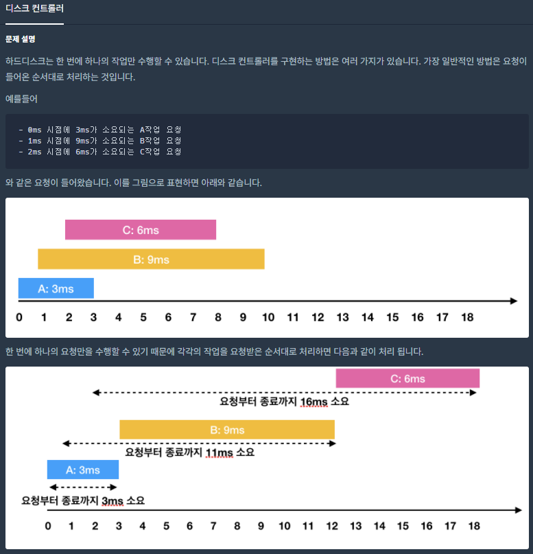
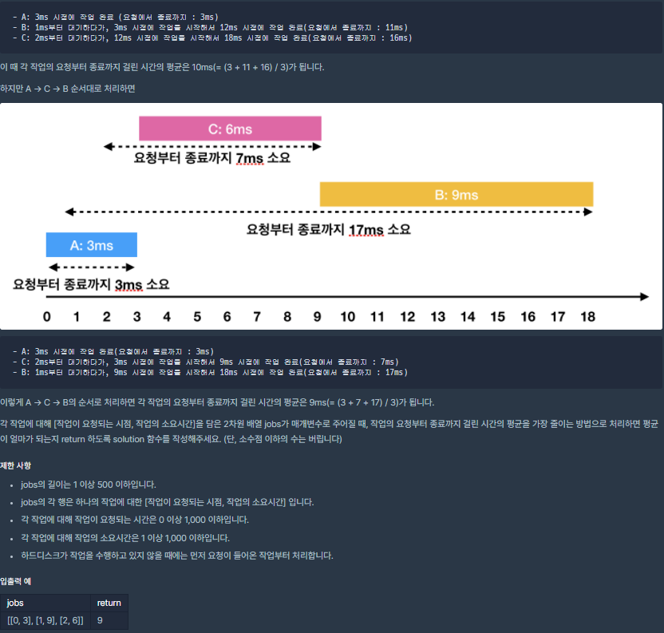

## [[Lv. 3] 디스크 컨트롤러](https://programmers.co.kr/learn/courses/30/lessons/42627#)


___

## 💡 풀이
- 평균 대기(요청~종료)시간을 가장 최적화 할 수 있는 스케줄링 방식은 `SJF`이다.
    - 먼저, 요청 시각에 따라 shortest-job을 분류하기 위해 입력으로 주어진 jobs를 `요청 시각에 따라 오름차순`으로 정렬해야 한다.
    - 다음으로, 현재 시각을 기준으로 주어진 작업의 요청 시각이 현재 시각 이전이라면, 우선순위 큐(Min Heap)에 삽입하여 `소요 시간이 짧은 순서`대로 정렬한다.
> 자세한 구현 방법은 주석을 참고.
___
## ✍ 피드백
- 문제를 딱 보자마자, OS에서 배운 SJF(Shortest-Job-First) 스케줄링이 떠올랐다.
- 그러나, 요청 시각에 따라 shortest-job을 분류하는 과정을 구현하는 데 시간이 오래 걸렸었다.
___
```c++
#include <string>
#include <vector>
#include <queue>
#include <algorithm>

using namespace std;

int solution(vector<vector<int>> jobs) {
    int idx = 0, time = 0, waiting_time = 0;

    // 요청 시각 기준 오름차순 정렬
    sort(jobs.begin(), jobs.end());
    // Min Heap
    priority_queue<pair<int, int>, vector<pair<int, int>>, greater<pair<int, int>>> pq;
    
    // 인덱스 범위 초과 && 우선순위 큐 empty -> 반복문 탈출
    while (idx < jobs.size() || !pq.empty()) {       
        // 현재 job의 요청 시각이 현재 시각 이하인 경우
        while(idx < jobs.size() && time >= jobs[idx][0]) { 
            // 우선순위 큐에 삽입(소요시간 기준으로 Min-Heap 정렬)
            pq.emplace(jobs[idx][1], jobs[idx][0]);
            // 다음 job
            idx++; 
        } 
        
        // 현재 시각 기준으로, 작업 요청이 들어온 job이 있는 경우
        if(!pq.empty()) { 
            // 현재 시각을 current-shortest-job의 요청시간으로 조정
            time += pq.top().first;
            // current-shortest-job의 요청~종료까지 걸린 시간
            waiting_time += time - pq.top().second;
            pq.pop(); 
        } 
        // 현재 시각 기준으로, 작업 요청이 들어온 job이 없는 경우
        else 
            // 다음 job의 요청이 들어온 시각으로 현재 시각 조정
            time = jobs[idx][0]; 
    } 
    
    return waiting_time / jobs.size();
}
```