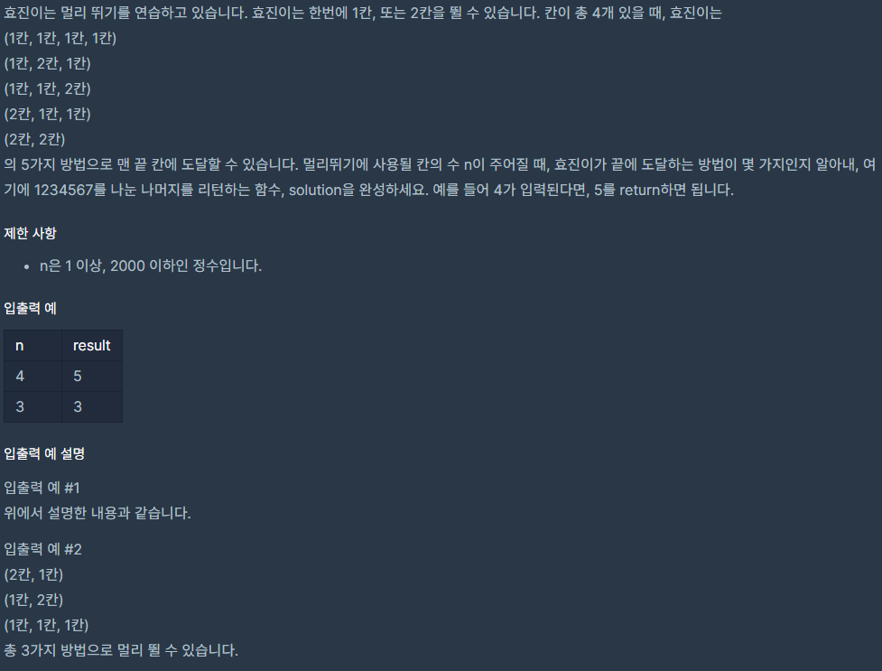

## [[Lv. 3] 멀리 뛰기](https://programmers.co.kr/learn/courses/30/lessons/12914)
<br>
<br>
___

## 💡 풀이
- 규칙성을 먼저 파악한 뒤, `재귀함수` 혹은 `동적계획법`으로 해결하는 전형적인 문제이다.
- 규칙성은 다음과 같았다.
    > 1칸 경우의 수 : 1<br>
    > 2칸 경우의 수 : 2<br>
    > 3칸 경우의 수 : 3<br>
    > 4칸 경우의 수 : 5<br>
    > 5칸 경우의 수 : 8<br>
    > ...
- 즉, n > 2 일 때, `dp[n] = dp[n - 1] + dp[n - 2]` 을 만족한다.
___
```c++
#include <string>
#include <vector>

using namespace std;

long long solution(int n) {
    long long answer = 0;
    long long dp[2001] = {0, };
    dp[1] = 1;
    dp[2] = 2;
    
    int idx = 3;
    while(idx <= n){
        dp[idx] = (dp[idx - 1] + dp[idx - 2]) % 1234567;
        idx++;
    }
    
    answer = dp[n];
    return answer;
}
```