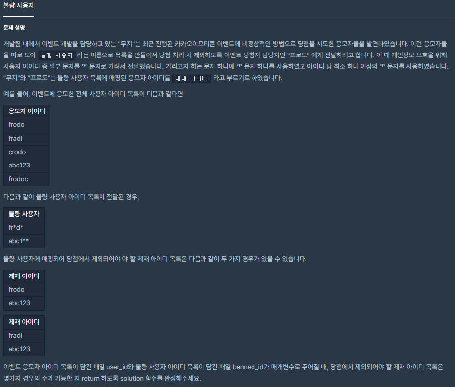
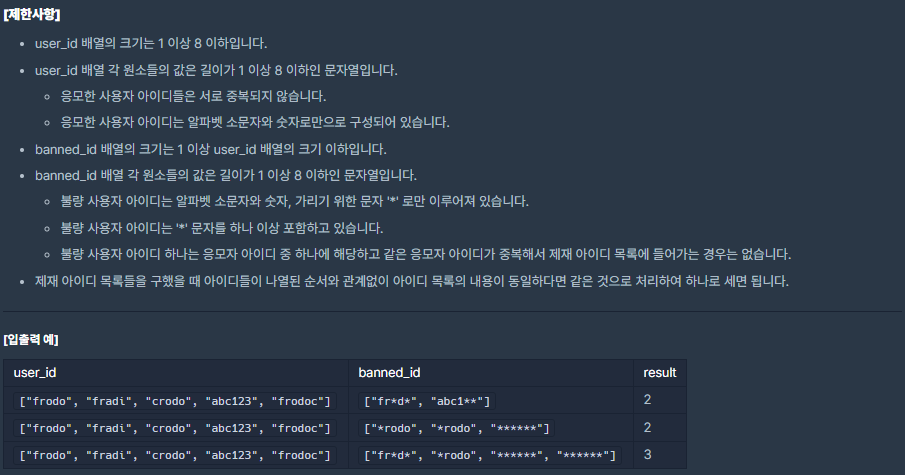

# [[Lv. 3] 불량 사용자](https://programmers.co.kr/learn/courses/30/lessons/64064)



___
## 🤔접근
1. <b>제재 아이디 목록들을 구했을 때, 아이디들이 나열된 `순서와 관계없이` 아이디 목록의 내용이 동일하다면, 같은 것으로 처리하여 하나로 세어야 한다. </b>
	- 마침 user_id 배열의 최대 크기가 8이므로, `제재 아이디 목록을 bitmask로 표현`하여 중복을 불허하는 자료구조 `set에 저장`하자.
2. <b>제재 아이디 목록을 구할 때는 문자열 비교를 이용하자.</b>
	- `DFS`을 이용하여 모든 경우의 수를 구하자.
___
## 💡풀이
- <b>깊이 우선 탐색(DFS) 알고리즘</b>을(를) 이용하였다.
	1. 아이디 매칭 테스트에서는 각 문자열의 문자를 하나하나씩 비교하며, banned_id의 `*` 문자가 나올때는 비교를 생략한다.
	2. user_id가 이미 `제재 아이디 목록(bitmask)`에 포함되었거나, user_id가 banned_id와의 길이가 불일치할 경우, 다음 user_id와 비교한다.
	3. user_id가 banned_id에 해당하는 경우, 해당 user_id를 `제재 아이디를 목록(bitmask)`에 추가한 정보를 가지고 다음 banned_id를 탐색한다.
	4. banned_id의 인덱스를 초과한 경우, 종료 조건에 해당하며 `제재 아이디 목록(bitmask)`를 자료구조 set에 저장한다.
		> 참고로, set은 중복을 불허하므로 목록의 내용이 동일하다면 자동으로 하나로 간주한다.
	5. 최종적으로 set에 저장된 원소의 수를 반환한다.
___
## ✍ 피드백
___
## 💻 핵심 코드
```c++
#define MAX 8

set<int> cases;

// idx: banned_id 인덱스
// bitmask: 제재 user_id 목록. 조합(Combination)
void DFS(const vector<string>& user_id, const vector<string>& banned_id, int idx, int bitmask);

int solution(vector<string> user_id, vector<string> banned_id) {
    DFS(user_id, banned_id, 0, 0);
  
    return cases.size();
}

void DFS(const vector<string>& user_id, const vector<string>& banned_id, int idx, int bitmask){
    // 종료 조건
    if(idx == banned_id.size()){
        cases.insert(bitmask);
        return;
    }
    
    for(int j=0; j<user_id.size(); j++){
        bool flag = true;
        
        // 제재 목록에 존재하거나, 아이디 길이가 불일치한 경우
        if(bitmask & (1 << j) || user_id[j].size() != banned_id[idx].size())
            continue;
        
        // 아이디 매칭 테스트
        for(int i=0; i<user_id[j].size(); i++){
            if(banned_id[idx][i] == '*' || user_id[j][i] == banned_id[idx][i])
                continue;
            flag = false;
            break;
        }
        
        // 다음 banned_id 비교
        if(flag)
            DFS(user_id, banned_id, idx + 1, bitmask | (1 << j));
    }
}
```