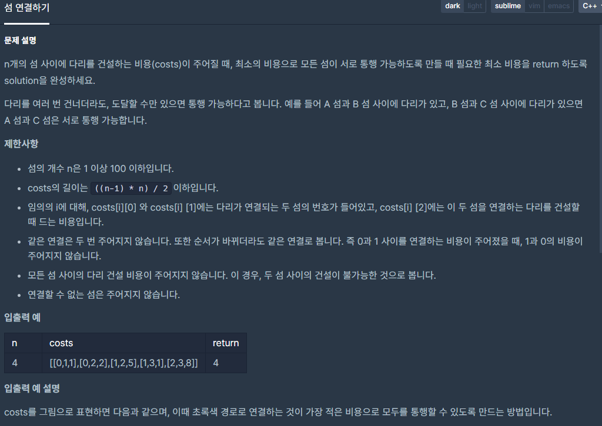

## [[Lv. 3] 섬 연결하기](https://programmers.co.kr/learn/courses/30/lessons/42861)


___

## 💡 풀이
- 최소신장트리(MST) 알고리즘을 이용하여 해결하였다.
    - 먼저, 가중치를 기준으로 간선들을 오름차순으로 정렬한다.
    - union-find 알고리즘을 이용하여 순서대로 각 간선의 두 정점을 같은 집합으로 union하며, 가중치를 건설비용에 추가한다.
        - 만약, 이미 같은 집합이라면 union하지 않는다.
___
```c++
#include <string>
#include <vector>
#include <algorithm>

using namespace std;

int par[100];
int Rank[100];

int find(const int& vertex) {
	if (par[vertex] == vertex)
		return vertex;

	return par[vertex] = find(par[vertex]);
}

void merge(const int& v1, const int& v2) {
	int par1 = find(v1);
	int par2 = find(v2);

	if (par1 == par2)
		return;

	if (Rank[par1] > Rank[par2])
		swap(par1, par2);
	par[par1] = par2;

	if (Rank[par1] == Rank[par2])
		++Rank[par2];
}

bool cmp(const vector<int>& v1, const vector<int>& v2) {
	return v1[2] < v2[2] ? true : false;
}

int solution(int n, vector<vector<int>> costs) {
    int answer = 0;
    
    // union-find's base conditon
    for(int i=0; i<n; i++)
        par[i] = i;   
    fill(Rank, Rank + n, 1);
    // Minumum Spanning Tree's base condition
    sort(costs.begin(), costs.end(), cmp);
    
    // MST algorithm
    for(int i=0; i<costs.size(); i++){
        if(find(costs[i][0]) != find(costs[i][1])){
            answer += costs[i][2];
            merge(costs[i][0], costs[i][1]);
        }
    }
    
    return answer;
}
```