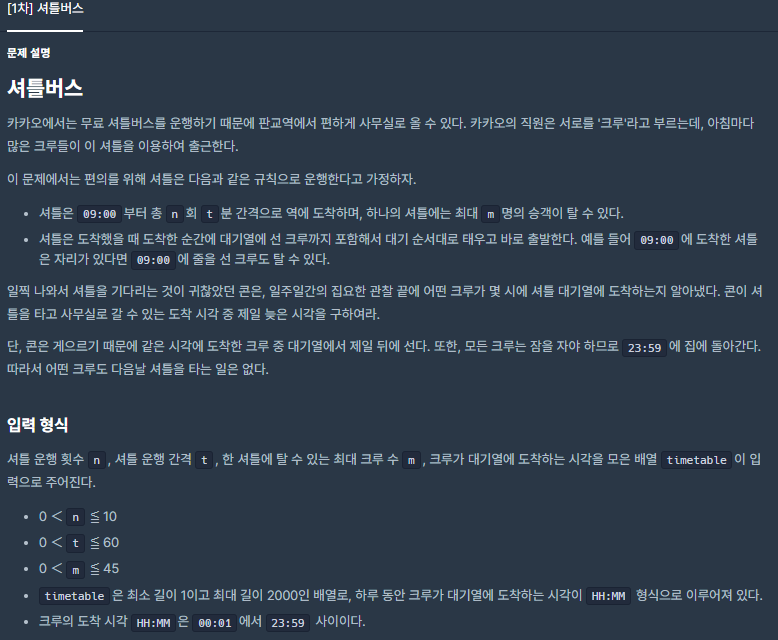
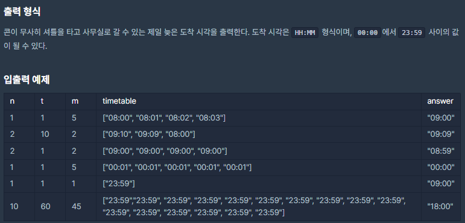

# [[Lv. 3] 셔틀버스](https://programmers.co.kr/learn/courses/30/lessons/17678)



___
## 🤔접근
1. <b>마지막 버스에 모두 탑승했는지 여부를 확인하자.</b>
	- 마지막 버스에 모두 탑승했다면, 마지막 탑승한 승객보다 1분 빠르게 타면 된다.
	- 그렇지 않다면, 마지막 버스 출발 시간에 타면 된다.
___
## 💡풀이
- <b>문자열을 다루는 구현</b> 문제이다.
	- 먼저, 승객들이 도착한 시간을 오름차순으로 정렬한다.
	- 다음으로, 셔틀 운행 횟수를 기준으로 반복문을 수행한다.
		- timetable을 차례대로 확인하면서, 버스 출발 시간 이전에 도착한 승객들을 태운다.
		- 이 때, 모든 승객을 확인했거나, 버스에 승객이 모두 탑승한 경우 버스를 출발시킨다.
		- 다음으로, 현재 시간(문자열)에 셔틀 운행 간격 t(정수)을 더하여 다음 셔틀의 출발 시간을 구한다.
			- `takeMinutes(int, string)` 함수 이용
	- 반복문이 끝나면, 마지막 버스에 승객들이 탑승한 시간들이 저장되어 있다.
		- 마지막 버스에 승객이 최대로 탑승했다면, `마지막 승객보다 1분 빠른 시간`을 반환한다.
		- 마지막 버스에 자리가 남아있다면, `마지막 버스의 출발 시간`을 반환한다.
- <b>현재 시간(문자열)에 정수형 시간을 더하여 문자열로 출력하는 함수를 구현하였다.</b>
	1. 먼저, 현재 시간(문자열)을 아스키코드를 이용하여 각 자리수마다 정수형으로 바꾸고, `분 단위`로 값을 구한다.
	2. 위의 값과 매개변수로 넘어온 정수형 시간을 더한다.
	3. 더한 시간을 각 자리수의 문자로 바꾸어 반환한다.
		- 시간 십의 자리: `sum / 60 / 10`
		- 시간 일의 자리: `sum / 60 % 10`
		- 분 십의 자리: `sum % 60 / 10`
		- 분 일의 자리: `sum % 60 % 10`
___
## ✍ 피드백
___
## 💻 핵심 코드
```c++
string takeMinutes(int minutes, string curTime) {  
    int curMinutes = 0;
    curMinutes += (curTime[0] - '0') * 600;
    curMinutes += (curTime[1] - '0') * 60;
    curMinutes += (curTime[3] - '0') * 10;
    curMinutes += (curTime[4] - '0');
    
    int sum = minutes + curMinutes;

    string finalTime = "00:00";
    finalTime[0] = (sum / 60 / 10) + '0';
    finalTime[1] = (sum / 60 % 10) + '0';
    finalTime[3] = (sum % 60 / 10) + '0';
    finalTime[4] = (sum % 60 % 10) + '0'; 
    return finalTime;
}

string solution(int n, int t, int m, vector<string> timetable) {
    sort(timetable.begin(), timetable.end());

    vector<string> inBus;
    string curTime;
    string nextTime = "09:00";
    for (int i = 1, idx = 0; i <= n; i++) {
        curTime = nextTime;
        inBus.clear();
        while (inBus.size() < m && idx < timetable.size()) {
            if (timetable[idx] <= nextTime) 
                inBus.push_back(timetable[idx++]);
            else
                break;
        }
        nextTime = takeMinutes(t, curTime);
    }

    string answer = "";
    if (inBus.size() == m) { // 막차가 꽉 찬 경우
        int lastTime = stoi(inBus.back().substr(0, 2)) * 60 + stoi(inBus.back().substr(3, 2));

        answer = takeMinutes(lastTime - 1, "00:00"); // 마지막 도착 승객보다 1분 빠른 시간
    }
    else // 막차가 덜 찬 경우
        answer = curTime; // 막차 출발 시간
    return answer;
}
```