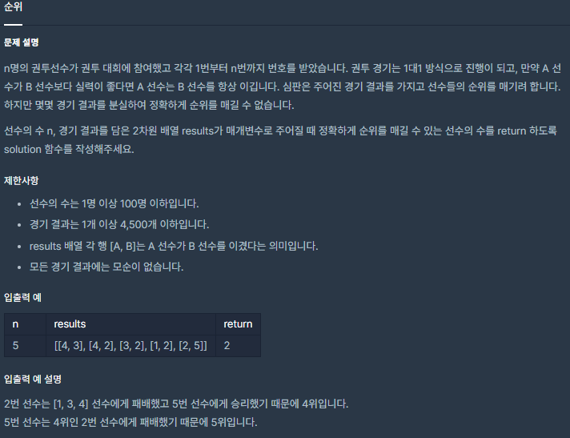

## [[Lv. 3] 순위](https://programmers.co.kr/learn/courses/30/lessons/49191)

___

## 💡 풀이
- 코드 주석 참고
___
## ✍ 피드백
- 처음에는 Disjoint-Set 알고리즘을 떠올렸지만, 결국 주어진 경기 결과를 토대로, 분실한 경기 결과를 최대한 알아내는 것이 핵심이라는 것을 깨닫게 되었다.
- 이후 문제를 다시 읽어보며, 핵심 문장을 발견하고 방향을 바꾸었다.
    > "만약 A 선수가 B 선수보다 실력이 좋다면 A 선수는 B 선수를 항상 이깁니다."
    - A가 B를 이겼다는 결과가 주어졌다면, 이는 절대적인 결과로 간주하기 때문에, `방향 그래프`를 이용하여 `경로`를 압축시키는 방식을 사용할 수 있겠다는 생각을 하게 되었고, 플로이드-와샬 알고리즘을 사용하여 해결하게 되었다.

___
```c++
#include <string>
#include <vector>

using namespace std;

int solution(int n, vector<vector<int>> results) {
    int answer = 0;   
    vector<vector<bool>> graph(n, vector<bool>(n, false));
    
    for (auto& r : results)  
        graph[r[0] - 1][r[1] - 1] = true;
    
    // 주목 할 문장 : "만약 A 선수가 B 선수보다 실력이 좋다면 A 선수는 B 선수를 항상 이깁니다."
    
    // 선수를 node라 할 때, A 선수가 B 선수를 이긴 경우, A node -> B node 으로 연결되어 있다고 볼 수 있음.
    // 따라서, 추상 자료구조인 그래프를 이용하여 경기 결과를 저장함.
    
    // 만약, A 선수가 B 선수를 이기고, B 선수가 C 선수를 이겼다면,
    // A 선수가 C 선수를 이겼다는 결과가 주어지지 않아도, A 선수는 C 선수를 이겼다고 판단할 수 있음.
    // 그러므로, 플로이드-와샬 알고리즘을 이용하면, 이러한 경로(A->B->C)를 압축(A->C)함으로써, 분실된 경기 결과를 알아낼 수 있음. - O(N³)
    
    // 중간 지점
    // 출발 - 도착 사이의 모든 경우의 중간 지점을 따져보기 위해 가장 바깥 for문에 배치함
    for (int mid = 0; mid < n; mid++) 
        // 출발 지점
        for (int start = 0; start < n; start++) 
            // 도착 지점
            for (int dest = 0; dest < n; dest++) 
                // 출발->중간 && 중간->도착이면?
                if (graph[start][mid] && graph[mid][dest]) 
                    graph[start][dest] = true;

    for (int i = 0; i < n; i++) {
        int count = 0;
        
        for (int j = 0; j < n; j++) 
            if (graph[i][j] || graph[j][i]) 
                count++;
        
        // 어떤 선수의 확실한 경기 결과가 n-1개이면?        
        if (count == n - 1) 
            answer++;
    }
    
    return answer;
}
```