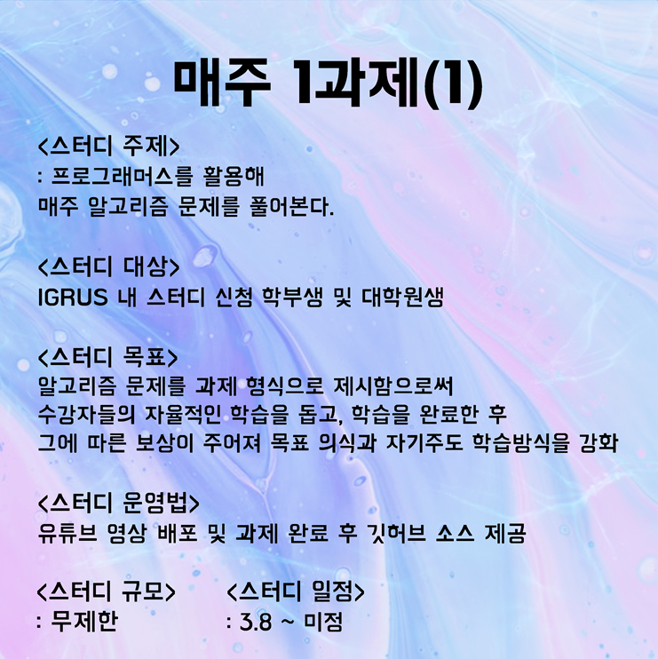
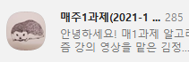
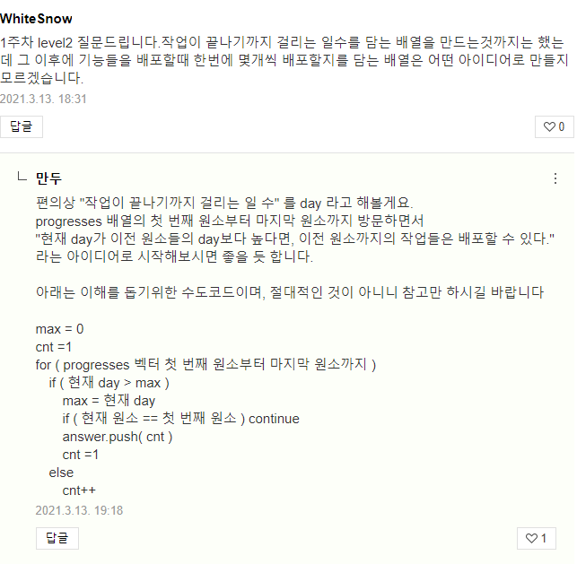

## [인하대학교 컴퓨터공학과 동아리 IGRUS 스터디(매주 1과제)](https://blog.naver.com/ache159/222265027556)
 
- 매주 알고리즘 level 1~3 + sql 문제를 풀어서 인증하는 스터디이다. 
- 막히는 부분이 있으면 블로그나 단톡을 통해 서로 도와주는 식으로 진행하며,  각 주차의 월요일마다 운영진들이 제작한 정답과 풀이영상, 그리고 다음 주차 문제에 필요한 알고리즘과 이론 등에 대한 강의가 올라온다.  
 (규모가 꽤 크다..)  

    > 나도 귀여운 후배(맞겠지?) 한명 도와줬다 ㅎㅎ
