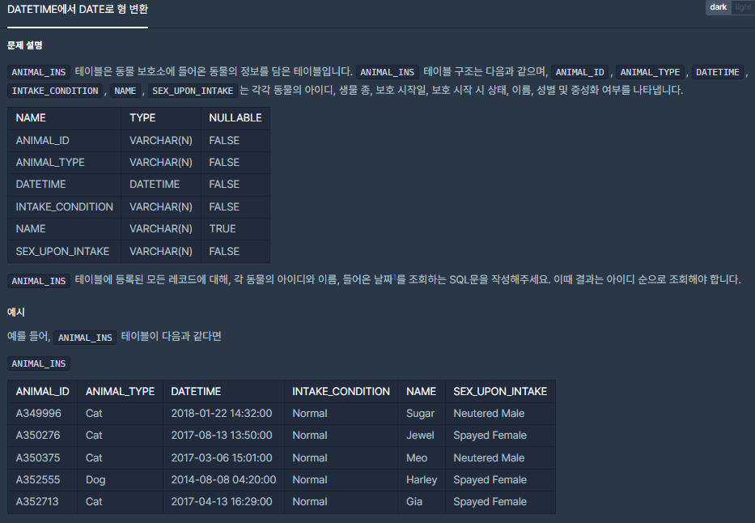
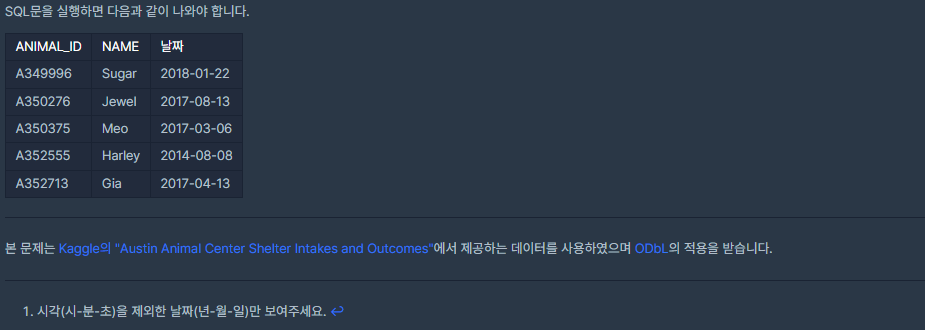

# [[SQL] DATETIME에서 DATE로 형 변환](https://programmers.co.kr/learn/courses/30/lessons/59414(DATETIME))



___
## 🤔접근
___
## 💡풀이
- <b>DATE_FORMAT 구문</b>을(를) 사용하였다.
	```sql
	DATE_FORMAT(DATE, 형식)
	```
	- 형식은 다음과 같다.
		- `%Y`: 4자리 연도
		- `%y`: 2자리 연도
		- `%m`: 월
		- `%d`: 일
		- `%H`: 24시간
		- `%h`: 12시간
		- etc.
	- [Reference](https://www.w3schools.com/sql/func_mysql_date_format.asp)
___
## ✍ 피드백
___
## 💻 핵심 코드
```sql
SELECT ANIMAL_ID, NAME, DATE_FORMAT(DATETIME, '%Y-%m-%d') AS '날짜' FROM ANIMAL_INS
```