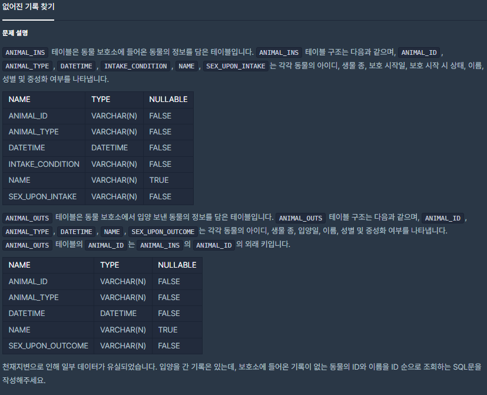
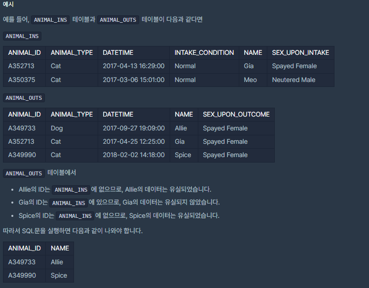

# [[SQL] 없어진 기록 찾기](https://programmers.co.kr/learn/courses/30/lessons/59042)



___
## 🤔접근
- 입양은 간 기록(`ANIMAL_OUTS`)은 있는데, 보호소에 들어온 기록(`ANIMAL_INS`)은 없는 동물을 찾아야 한다.
___
## 💡풀이
- <B>LEFT JOIN</B>함수를 사용하였다.
	- `ANIMAL_INS` 테이블에는 존재하지 않고(`NULL`) , `ANIMAL_OUTS` 테이블에는 존재하는 데이터를 뽑아내야 한다.
		```SQL
		FROM ANIMAL_OUTS
		LEFT JOIN ANIMAL_INS
		ON ANIMAL_OUTS.ANIMAL_ID = ANIMAL_INS.ANIMAL_ID
		WHERE ANIMAL_INS.ANIMAL_ID IS NULL
		```
___
## ✍ 피드백
___
## 💻 핵심 코드
```sql
SELECT ANIMAL_OUTS.ANIMAL_ID, ANIMAL_OUTS.NAME 
FROM ANIMAL_OUTS
LEFT JOIN ANIMAL_INS
ON ANIMAL_OUTS.ANIMAL_ID = ANIMAL_INS.ANIMAL_ID
WHERE ANIMAL_INS.ANIMAL_ID IS NULL
ORDER BY ANIMAL_OUTS.ANIMAL_ID
```