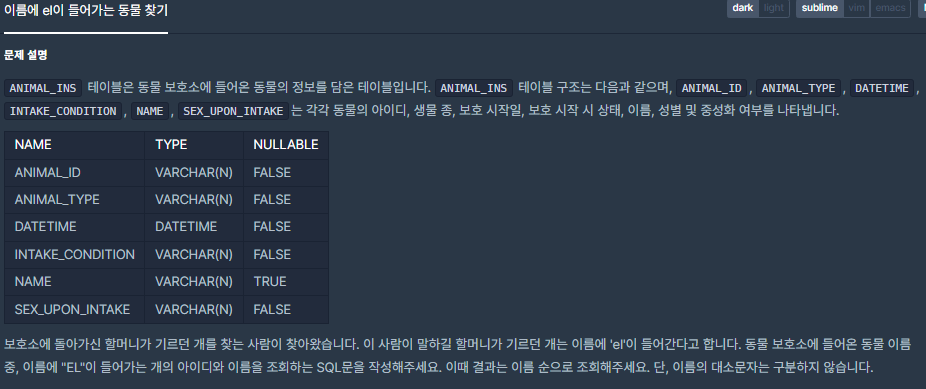

# [[SQL] 이름에 el이 들어가는 동물 찾기](https://programmers.co.kr/learn/courses/30/lessons/59047)



___
## 🤔접근
___
## 💡풀이
- <b>LIKE 구문</b>을 사용하였다.
	- 쿼리문 WHERE 절에 주로 사용되며, 부분적으로 일치하는 칼럼을 찾을 때 사용한다.
	- `SELECT * FROM [테이블명] WHERE LIKE [조건]`
- <b>사용법</b>
	- `'_'`: 글자 숫자를 정해줌
		> ex) 컬럼명 LIKE '홍_동'
	- `'%'`: 글자 숫자를 정해주지 않음
		> ex) 컬럼명 LIKE '홍%'
- <b>예시</b>
	```sql
	--A로 시작하는 문자를 찾기--
	SELECT 컬럼명 FROM 테이블 WHERE 컬럼명 LIKE 'A%'

	--A로 끝나는 문자 찾기--
	SELECT 컬럼명 FROM 테이블 WHERE 컬럼명 LIKE '%A'

	--A를 포함하는 문자 찾기--
	SELECT 컬럼명 FROM 테이블 WHERE 컬럼명 LIKE '%A%'

	--A로 시작하는 두 글자 문자 찾기--
	SELECT 컬럼명 FROM 테이블 WHERE 컬럼명 LIKE 'A_'

	--첫 번째 문자가 'A'가 아닌 모든 문자열 찾기--
	SELECT 컬럼명 FROM 테이블 WHERE 컬럼명 LIKE'[^A]'

	--첫 번째 문자가 'A' 또는 'B' 또는 'C'인 문자열 찾기--
	SELECT 컬럼명 FROM 테이블 WHERE 컬럼명 LIKE '[ABC]'
	SELECT 컬럼명 FROM 테이블 WHERE 컬럼명 LIKE '[A-C]'
	```
___
## ✍ 피드백
___
## 💻 핵심 코드
```sql
SELECT ANIMAL_ID, NAME FROM ANIMAL_INS WHERE NAME LIKE '%el%' AND ANIMAL_TYPE = 'Dog' ORDER BY NAME
```